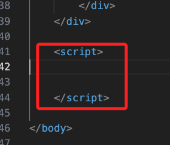
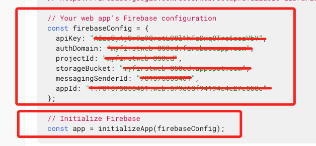
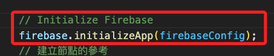
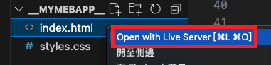
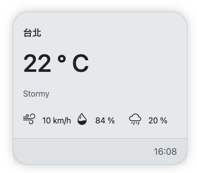
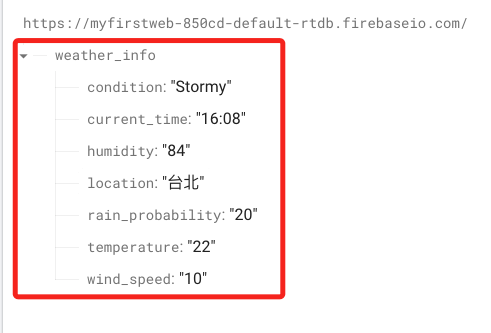

# 連線 Firebase Realtime Database

<br>

## 複製 API 資訊

1. 在 `<body></body>` 區的最後面添加 `<script></script>` 腳本區塊。

    

<br>

2. 將 `firebaseConfig` 以及 `initializeApp` 部分複製貼在 `<script></script>` 區域內。

    

<br>

3. 修改為 `firebase` 來調用初始化函數，這個物件是由 `Firebase JavaScript SDK` 所提供的，一但在 <script> 中引入 `Firebase SDK`，文本全局就可調用 `firebase`。

    ```html
    <script>
    firebase.initializeApp(firebaseConfig);    
    </script>
    ```
    _如下_
    

<br>

4. 這裡應該補一個全部 `<script> </script>` 內容的腳本讓同學好對照是不是遺漏了什麼。

<br>

## 撰寫腳本

1. 建立資料庫的參考。

    ```html
    <script>
      // 建立節點的參考
      var weatherInfoRef = firebase.database().ref("weather_info");
      // 使用 on() 來持續監聽指定節點，一但有變化就會觸發
      weatherInfoRef.on("value", (snapshot) => {
        // 這裡就會放入主要的程序
      });
    </script>
    ```

<br>

2. 在內部放上主要程序，整個 `weatherInfoRef` 函數內容說明如下。

    ```html
    <script>
      weatherInfoRef.on("value", (snapshot) => {
        const data = snapshot.val();

        if (data) {
          let locationElem = document.querySelector(".card-title");
          let temperatureElem = document.querySelector(".temperature");
          let conditionElem = document.querySelector(".condition");
          let windSpeedElem = document.querySelector(".wind-speed");
          let humidityElem = document.querySelector(".humidity");
          let rainProbabilityElem = document.querySelector(".rain-probability");
          let timeElem = document.querySelector(".time");

          if (locationElem.innerText !== data.location) {
            locationElem.innerText = data.location;
            highlightAndRevert(locationElem);
          }
          if (temperatureElem.innerText !== data.temperature + " ") {
            // 加上空格
            temperatureElem.innerText = data.temperature + " "; // 加上空格
            highlightAndRevert(temperatureElem);
          }
          if (conditionElem.innerText !== data.condition) {
            conditionElem.innerText = data.condition;
            highlightAndRevert(conditionElem);
          }
          if (windSpeedElem.innerText !== data.wind_speed + " ") {
            // 加上空格
            windSpeedElem.innerText = data.wind_speed + " "; // 加上空格
            highlightAndRevert(windSpeedElem);
          }
          if (humidityElem.innerText !== data.humidity + " ") {
            // 加上空格
            humidityElem.innerText = data.humidity + " "; // 加上空格
            highlightAndRevert(humidityElem);
          }
          if (rainProbabilityElem.innerText !== data.rain_probability + " ") {
            // 加上空格
            rainProbabilityElem.innerText = data.rain_probability + " "; // 加上空格
            highlightAndRevert(rainProbabilityElem);
          }
          if (timeElem.innerText !== data.current_time) {
            timeElem.innerText = data.current_time;
            highlightAndRevert(timeElem);
          }
        } else {
          const defaultData = {
            location: "台北",
            temperature: "22",
            condition: "Stormy",
            wind_speed: "10",
            humidity: "84",
            rain_probability: "20",
            current_time: "16:08",
          };
          weatherInfoRef.set(defaultData);
        }
      });
    </script>
    ```

<br>

3. 添加一個高亮的功能，若數據發生變化時，會先變為紅色兩秒鐘，然後恢復原色。

    ```html
    <script>
      // 高亮
      function highlightAndRevert(element) {
        element.classList.add("highlighted");
        setTimeout(() => {
          element.classList.remove("highlighted");
        }, 2000); // 2秒後移除
      }
    </script>
    ```

<br>

## 進行瀏覽

1. 使用插件開啟 Live Sever。

    

<br>

2. 網頁畫面。

    

<br>

3. 開啟資料庫畫面，添加了一個節點 `weather_info`。

    

<br>

4. 手動進行節點資料變動來模擬節點數據改變，會發現網頁也即時變動了。

<br>

___

_END_