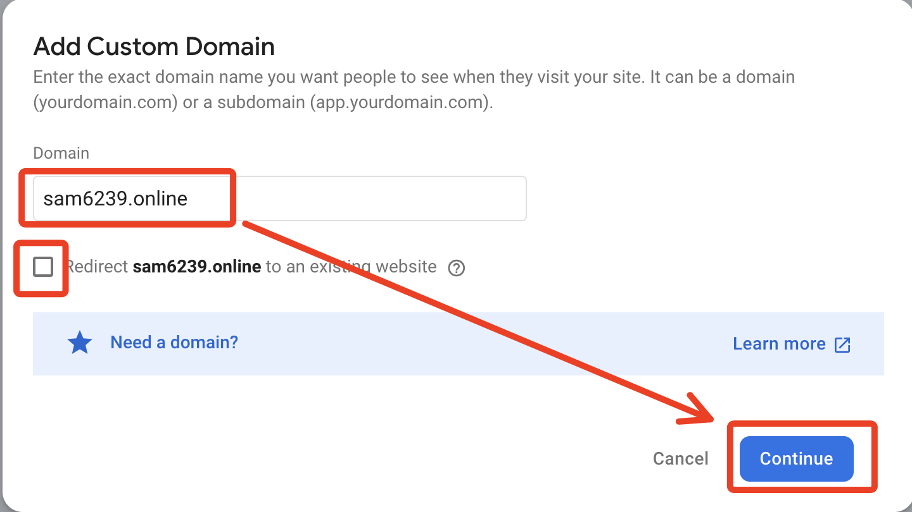
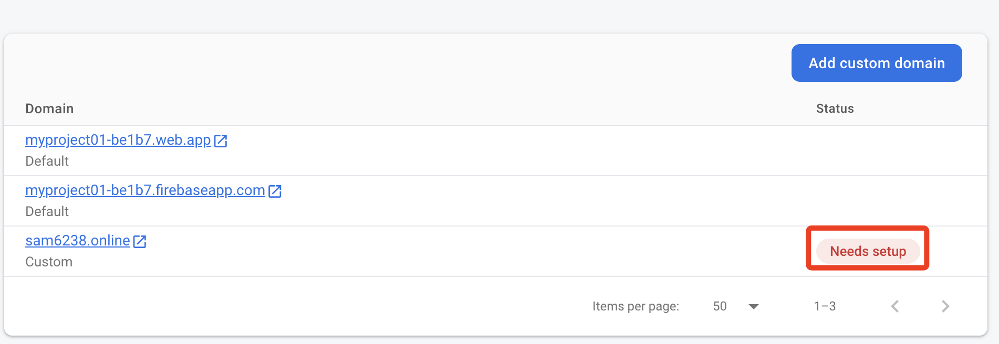

# 轉址設定

_以下使用 GoDaddy 服務示範_

 

## 步驟

1. 進入。

   

 

2. 點擊。

   

 

3. 輸入註冊的網址。

   

 

4. 基本上這樣就完成了。

   

 

5. 這裡部署的是另一個站台，內容與前面範例不一樣，無需在意。

   

 

6. 可點擊進行進階設定，有興趣同學可以自行研究。

   

 

___

_END_