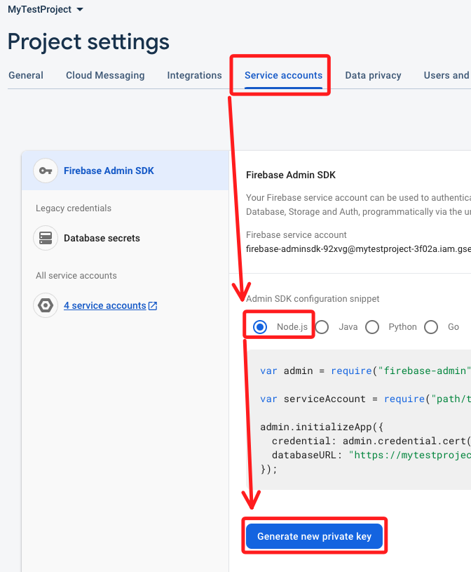
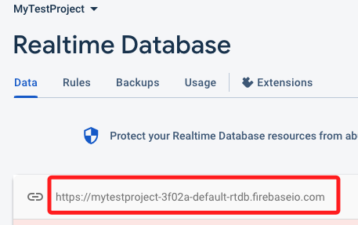

# 寫入節點

_取得樹莓派溫度並寫入資料庫_

<br>

## 成果

1. 寫入。

    

<br>

2. 網頁。

    

<br>

## 步驟

1. 安裝。

    ```bash
    pip install firebase-admin
    ```

<br>

2. 進入 `Firebase` 專案，點擊 `Build`。

    

<br>

3. 建立資料庫。

    

<br>

4. 選取位置。

    

<br>

5. 設定模式。

    

<br>

6. 設定權限。

    

<br>

7. 進入專案設定。

    

<br>

8. 下載 `Private Key`。

    

<br>

9. 下載。

    

<br>

10. 將憑證加入之前，可先寫入 `.gitignore`。

    

<br>

11.  將憑證拖曳到專案中。

    

<br>

12. 複製資料庫 URL。

    

<br>

13. 先提示一下專案結構。

    

<br>

14. 安裝庫。

    ```bash
    pip install pytz
    ```

<br>

15. 貼上範例。

    ```python
    import time
    import subprocess
    import firebase_admin
    from firebase_admin import credentials
    from firebase_admin import db
    from datetime import datetime
    import pytz

    # 替換實際私鑰文件路徑
    if not firebase_admin._apps:
        cred = credentials.Certificate('./PrivateKey/mytestproject-3f02a-firebase-adminsdk-92xvg-da6d0138c2.json')
        firebase_admin.initialize_app(cred, {
            'databaseURL': 'https://mytestproject-3f02a-default-rtdb.firebaseio.com/'
        })

    # 樹莓派溫度讀取函數
    def get_pi_temperature():
        # 執行命令並返回溫度
        temp_output = subprocess.check_output(['vcgencmd', 'measure_temp']).decode()
        temp = float(temp_output.split('=')[1].split("'")[0])
        return temp

    # Firebase 中溫度數據的節點
    temp_ref = db.reference('/raspberrypi/temperature')

    # 台灣時區
    taiwan = pytz.timezone('Asia/Taipei')

    # 主循環
    while True:
        # 取得溫度
        temp = get_pi_temperature()
        print(f"Current temperature is: {temp} C")
        
        # 取得台灣時區的當前時間
        tz_now = datetime.now(taiwan)
        
        # 將溫度寫入 Firebase
        temp_ref.set({
            'timestamp': int(tz_now.timestamp()),
            'temperature': temp
        })
        
        # 每隔 10 秒鐘檢查一次（在網頁中顯示時可加快到1秒）
        time.sleep(10)
    ```

<br>

16. 切記替換兩處資料為自己的憑證與資料庫 URL。

    

<br>

17. 運行腳本之後去資料庫查看。

    

<br>

## 網頁

1. 建立 Web App。

    

<br>

2. 暱稱。

    

<br>

3. 複製這段貼在文本中。

    

<br>

4. 編輯文本。

    ```html
    <!DOCTYPE html>
    <html lang="en">
    <head>
    <meta charset="UTF-8">
    <title>Temperature Chart</title>
    <meta name="viewport" content="width=device-width, initial-scale=1">
    
    <!-- Bootstrap CSS -->
    <link rel="stylesheet" href="https://stackpath.bootstrapcdn.com/bootstrap/4.5.2/css/bootstrap.min.css">

    <!-- Firebase -->
    <script src="https://www.gstatic.com/firebasejs/8.0.0/firebase-app.js"></script>
    <script src="https://www.gstatic.com/firebasejs/8.0.0/firebase-database.js"></script>

    <!-- Chart.js -->
    <script src="https://cdn.jsdelivr.net/npm/chart.js"></script>
    </head>
    <body>

    <div class="container">
    <h2>Temperature Chart</h2>
    <canvas id="tempChart"></canvas>
    </div>

    <script>
    // 更改為自己的設定，從 Firebase 複製貼上即可
    var firebaseConfig = {
        // 更改為自己的
    };
    // 初始化 Firebase
    firebase.initializeApp(firebaseConfig);
    var database = firebase.database();

    // 初始化 Chart.js
    var ctx = document.getElementById('tempChart').getContext('2d');
    var tempChart = new Chart(ctx, {
        type: 'line',
        data: {
        labels: [],
        datasets: [{
            label: 'Temperature (°C)',
            data: [],
            backgroundColor: 'rgba(54, 162, 235, 0.2)',
            borderColor: 'rgba(54, 162, 235, 1)',
            borderWidth: 1
        }]
        },
        options: {
        scales: {
            yAxes: [{
            ticks: {
                beginAtZero: true
            }
            }]
        }
        }
    });

    // 監聽 Firebase
    var temperatureRef = firebase.database().ref('raspberrypi/temperature');
    temperatureRef.on('value', function(snapshot) {
        var temperature = snapshot.val().temperature;
        var timestamp = snapshot.val().timestamp;
        // 
        var date = new Date(timestamp * 1000);
        // 
        var label = date.getHours() + ':' + date.getMinutes().toString().padStart(2, '0') + ':' + date.getSeconds().toString().padStart(2, '0');

        // Update chart
        tempChart.data.labels.push(label);
        tempChart.data.datasets.forEach((dataset) => {
            dataset.data.push(temperature);
        });
        tempChart.update();
    });
    </script>

    </body>
    </html>

    ```

<br>

___

_END_