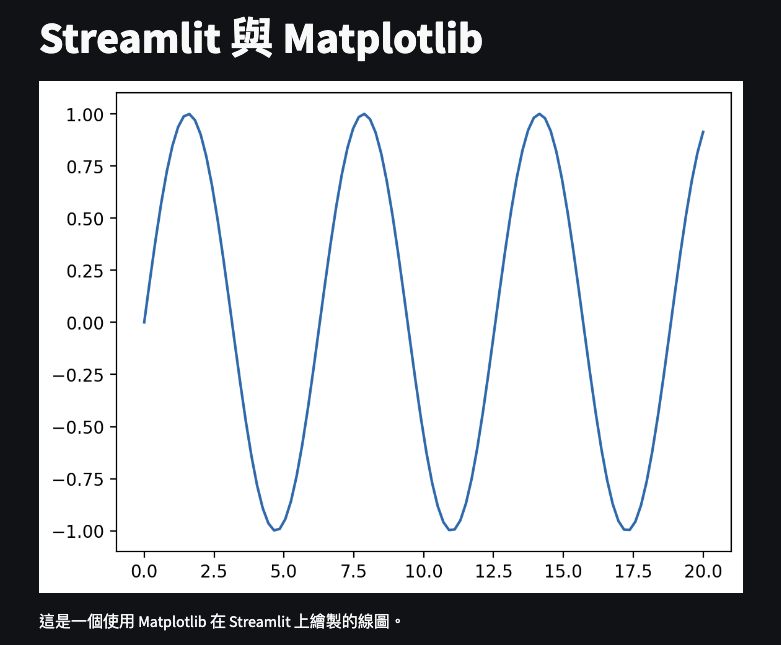

# 簡易線圖

<br>

## 成果



<br>

## 腳本

```python
import streamlit as st
import matplotlib.pyplot as plt
import numpy as np
st.title('Streamlit 與 Matplotlib')
fig, ax = plt.subplots()
x = np.linspace(0, 20, 100)
ax.plot(x, np.sin(x))
st.pyplot(fig)
st.write('這是一個使用 Matplotlib 在 Streamlit 上繪製的線圖。')
```

<br>

## Secrets

```toml
無
```

<br>

_END_