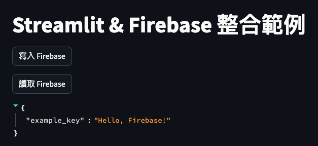

# 連結 Firebase Realtime Database
- 針對 Streamlit 會刷新頁面的狀況優化腳本，避免 Firebase SDK 物件再次建立。
  
<br>

## 成果



<br>

## 腳本

```python
import streamlit as st
import firebase_admin
from firebase_admin import credentials, db
import json

# 初始化 Firebase 
def initialize_firebase():
    try:
        firebase_admin.get_app()  # 若已初始化，直接返回
    except ValueError as e:
        # 先嘗試從 Streamlit Secrets 讀取憑證
        firebase_config_str = st.secrets.get('FIREBASE_CONFIG_STR', None)
        if firebase_config_str:
            try:
                cred_info = json.loads(firebase_config_str)
                cred = credentials.Certificate(cred_info)
            except Exception as e:
                st.error(f'解析 Streamlit Secrets 上的憑證出錯：{e}')
                return False
        else:
            # 嘗試從本地檔案讀取憑證
            try:
                with open('myproject01-be1b7-firebase-adminsdk-1mh85-36f2d814a2.json', 'r') as f:
                    cred_info = json.load(f)
                cred = credentials.Certificate(cred_info)
            except Exception as e:
                st.error(f'讀取本地 Firebase 憑證出錯，錯誤訊息：{e}')
                return False

        firebase_admin.initialize_app(cred, {
            'databaseURL': 'https://myproject01-be1b7-default-rtdb.asia-southeast1.firebasedatabase.app/'
        })
    return True

# Streamlit 主要內容
def main():
    st.title("Streamlit & Firebase 整合範例")

    if not initialize_firebase():
        st.error("Firebase 初始化失敗！")
        return

    # 寫入
    def write_to_firebase():
        ref = db.reference('data')
        ref.set({
            'example_key': 'Hello, Firebase!'
        })

    # 讀取
    def read_from_firebase():
        ref = db.reference('data')
        data = ref.get()
        return data

    # 按鈕
    if st.button("寫入 Firebase"):
        write_to_firebase()
        st.success("完成寫入到 Firebase 節點！")
    
    # 按鈕
    if st.button("讀取 Firebase"):
        data = read_from_firebase()
        if data:
            st.write(data)
        else:
            st.warning("Firebase 節點上無資料!")

if __name__ == "__main__":
    main()
```

<br>

## Secrets

```toml

```

<br>

_END_