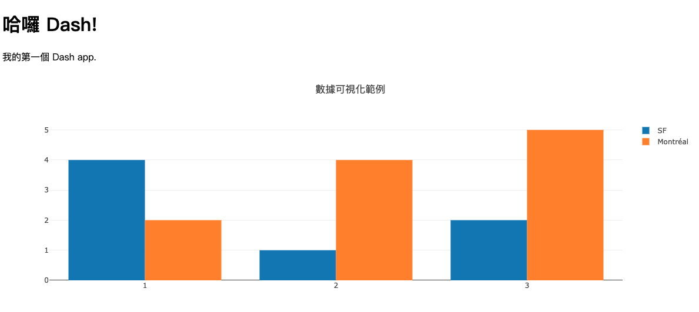
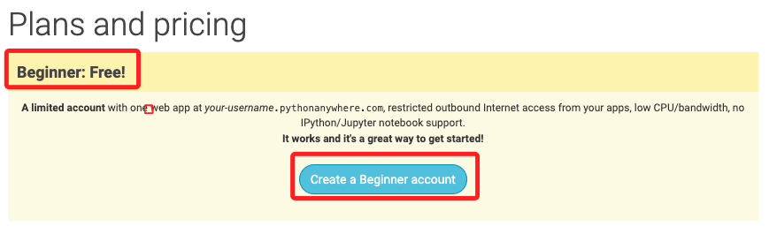
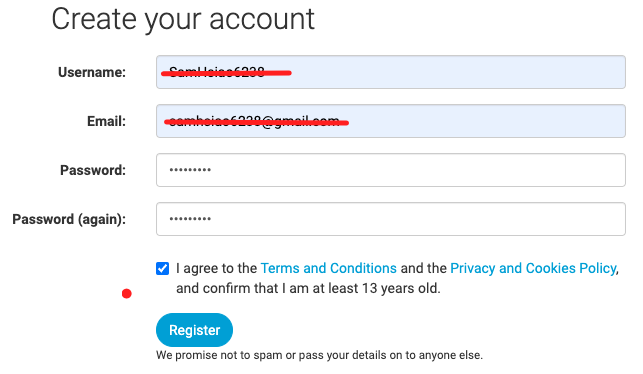
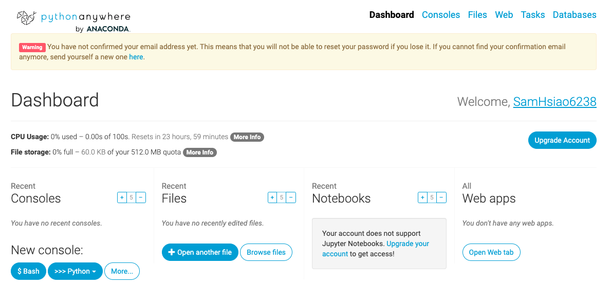

# PythonAnywhere

_要部署應用到 PythonAnywhere，先進行官網註冊_

 

## 成果圖

 

## 步驟

1. 前往 [PythonAnywhere 官網](https://www.pythonanywhere.com/) ，點擊 `Pricing & signup` 進行註冊。

   

 

2. 建立免費帳號。

   

 

3. 填寫基本資料。

   

 

4. 完成以上步驟便可進入看起來有點小複雜的主控台。

   

 

---

_END_
