# 部署到 PythonAnywhere

    _將一個簡單的 Dash App 部署到 PythonAnywhere_

<br>

## 建立一個 Dash App

1. 新建一個簡單的應用，編輯後存放在電腦用以示範如何部署到 `PythonAnywhere` 。

<br>

2. 任意命名即可，之後會在雲端進行相關設置，這裡的範例命名為 `DashApp_01.py`。

<br>

3. 安裝 `Dash` 所需套件，`Dash` 的安裝與應用可參考 [官網](https://dash.plotly.com/installation) 。

    ```bash
    pip install dash
    ```

<br>

4. 程式碼如下。

    ```python
   import dash
   from dash import dcc
   from dash import html

   app = dash.Dash(__name__)
   # 官網是這樣
   # app = Dash(__name__, external_stylesheets=external_stylesheets)
   server = app.server
   app.layout = html.Div([
       html.H1("哈囉 Dash!"),
       html.Div("我的第一個 Dash app."),
       dcc.Graph(
           id='example-graph',
           figure={
               'data': [{'x': [1, 2, 3], 'y': [4, 1, 2], 'type': 'bar', 'name': 'SF'},
                       {'x': [1, 2, 3], 'y': [2, 4, 5], 'type': 'bar', 'name': u'Montréal'}],
               'layout': {'title': '數據可視化範例'}
           }
       )
   ])
   #
   if __name__ == '__main__':
       # app.run_server(debug=True)
       # 依照官網寫法
       app.run(debug=True)
   ```


<br>

## 開始部署

1. 點選頁籤中的檔案 `Files` 。

   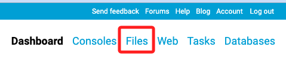

<br>

2. 點選上傳檔案 `Upload a file` 。

   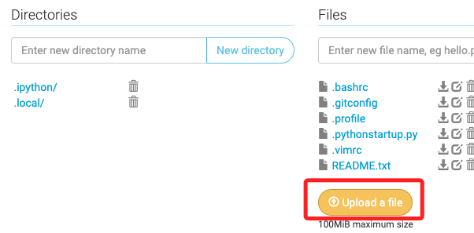

<br>

3. 選取本地電腦中的應用腳本。

   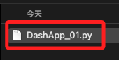

<br>

4. 完成時會看到檔案在清單中。

   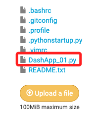

<br>

5. 進入主控台 `Consoles` 。

   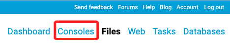

<br>

6. 點擊 `Bash` 開啟命令列工具，這是 `Shell` 中的一種。

   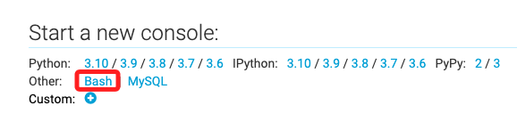

<br>

7. 開啟一個新的 `Shell` 。

   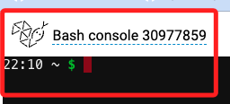

<br>

8. 輸入指令建立虛擬環境，_記住虛擬環境的名稱_ 稍後還會用到。

   ```bash
   mkvirtualenv mydashenv --python=/usr/bin/python3.8
   ```

   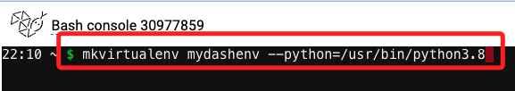

<br>

9. 啟動的時候會稍微靜止一段時間不用擔心，完成時顯示如圖。

   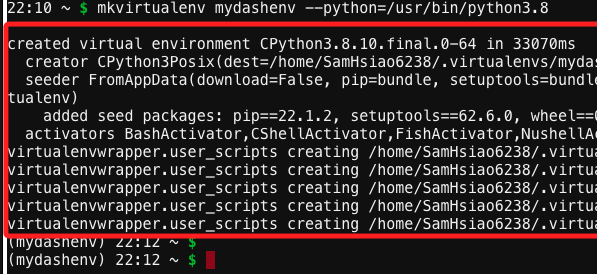

<br>

10. 在虛擬環境中安裝套件，其中 `flask` 應該是會自動安裝，可省。

    _安裝挺耗時_

    ```bash
    pip install dash flask gunicorn
    ```

    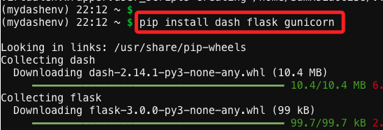

<br>

11. 點開右上方功能選單，選取 `Web` 。

    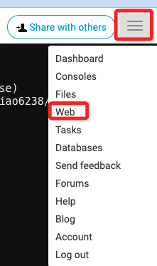

<br>

12. 添加應用 `Add a new app`。

    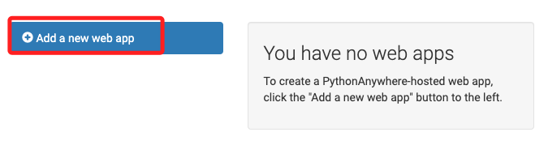

<br>

13. 直接選取 `Next` 。

    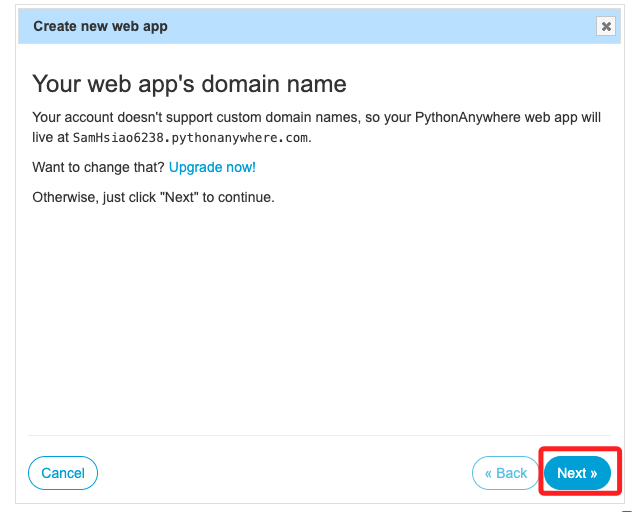

<br>

14. 選取手動設定 `Manual configuration`。

    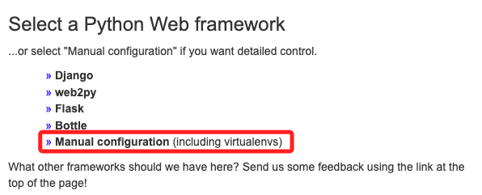

<br>

15. 這裡選 `3.8` 或其他相容版本皆可。

    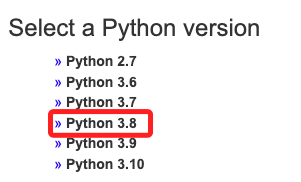

<br>

16. 完成就點擊 `Next`。

    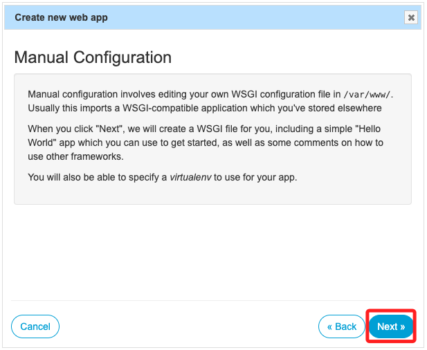

<br>

17. 往下滑動到 `Code` 區塊。

    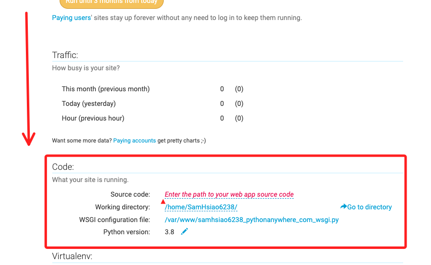

<br>

18. 點擊 `Source code` 右方輸入路徑的紅色文字。

    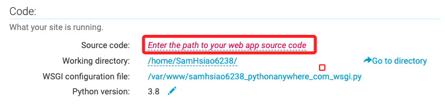

<br>

19. 填入路徑然後打勾。

    ```bash
    <複製下方工作路徑>/
    ```

    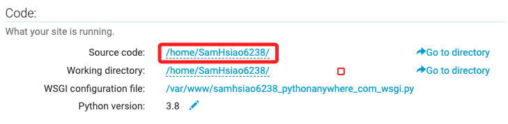


<br>

20. 提示一下，若輸入完整檔案名稱也是可以，雖之後會出現提示說這不是資料夾，但仍可正常運行。


    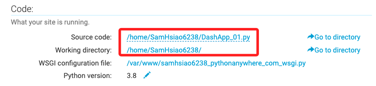

<br>

21. 接著設置虛擬環境，點擊紅色文字輸入路徑。

    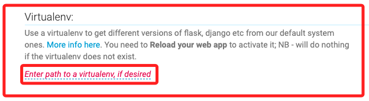

<br>

22. 填入然後打勾。

    ```bash
    <工作目錄>/<虛擬環境名稱>/
    ```

    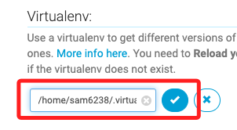

<br>

23. 完成時會顯示完整路徑，輸入錯誤的話會提示沒偵測到，所以不用擔心。

    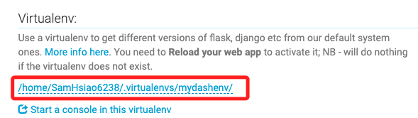

<br>

24. 點擊 `Start a console in this virtualenv` 以確認是否可以啟動。

    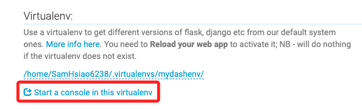

<br>

25. 啟動完成。

    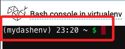

<br>

26. 這裡展示的是前面提到過，假如輸入完整路徑會出現的提示，但不影響結果。

    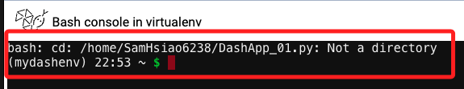

<br>

27. 返回上一頁，然後點擊 `WSGI configuration file` 進行編輯。

    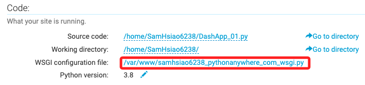

    _WSGI 是 Web Server Gateway Interface 的縮寫，這是一種規範，描述如何使用 Python 寫的 web 應用程序與 web 服務器進行通信的標準接口。_

<br>

28. 滑動到最後面，加入以下內容。

    ```python
    import sys
    sys.path.append('/<工作目錄>/<腳本名稱.py>')

    from <腳本名稱> import app
    application = app.server
    ```

    _記得替換自己的設置資訊，如下_
    
    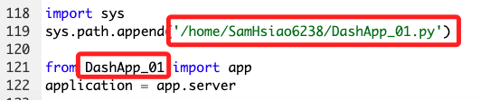

<br>

29. 把 `38` 行以下這段全部註解起來。

    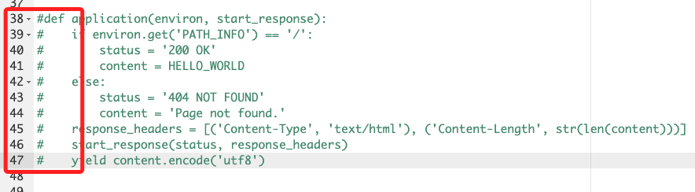

<br>

30. 點擊右上角的儲存。

    

<br>

31. 再回到 `Web` 。

    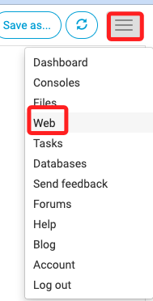

<br>

32. 重新載入。

    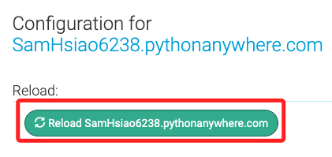

<br>

33. 點擊網址訪問。

    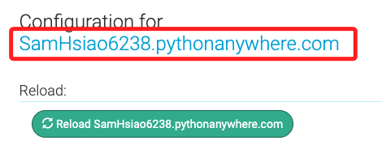

<br>

34. 成果。

    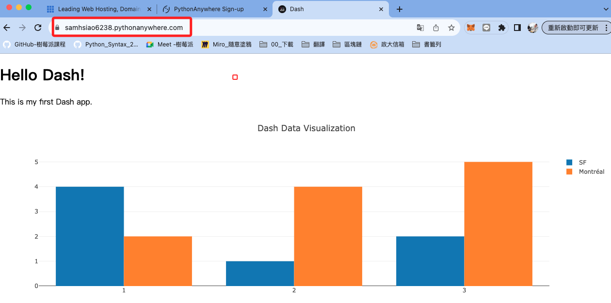

<br>

## 增修檔案

1. 進入 `Files`

   

<br>

2. 編輯或上傳新的檔案。

   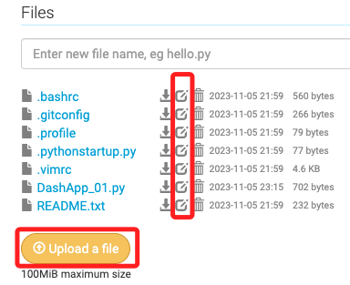

<br>

---

_END_