# 打包腳本

_這裡可使用撰寫好的吞食蛇腳本來示範，請先進行腳本複製_

<br>

##
1. 安裝套件。

    ```python
    python -m pip install pyinstaller
    ```

<br>

2. 打包指令。 

    ```python
    python -m PyInstaller -F <檔案.py> -i <圖片.ico>
    ```

<br>

3. 假如要加入 .ico，將圖檔放在目錄內並加上參數即可。

    ```python
    python -m PyInstaller -F <檔案.py> -i <圖片.ico>
    ```
    - Linux 系統通常不使用文件圖標來表示可執行文件，文件圖標主要是在 Windows 和 MacOS 系統中使用的。


<br>

4. 完成時會顯示成功。

    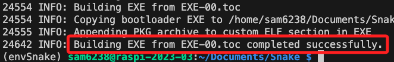

<br>

5. 原本的資料夾會多出幾個子資料夾與檔案。

    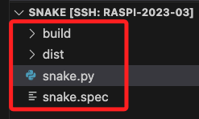

<br>

6. 主要的腳本在 `dist` 資料夾下，其餘都可以刪除。

    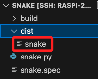

<br>

7. 刪除後僅保留主檔案。

    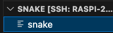

<br>

8. 對文件添加可執行的授權。

    ```bash
    chmod +x snake
    ```

<br>

9. 在腳本所在路徑中執行以下指令啟動腳本。

    ```bash
    ./snake
    ```

    _啟動_
    
    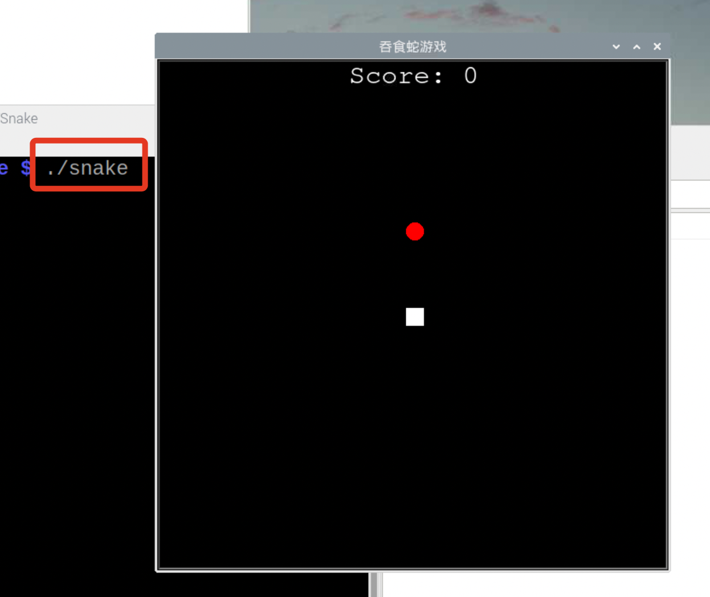


<br>

## 打包＋包含音樂檔案

_特別說明，透過參數 `--add-data` 會將資源檔案一起打包，執行時會自動解壓縮到臨時資料夾，所以要修改腳本來讀取_

<br>

1. 確認已將音頻加入資料夾 `sound` 中。

    _關於加入音頻後的第一次腳本修改，請參考吞食蛇範例中的 `加入音頻`_

    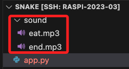

<br>

2. 再次修改腳本，在專案中導入兩個模組。

    ```python
    import os
    import sys
    ```

<br>

3. 接著，在 `Game` 類中添加一個靜態的路徑轉換函數。
    
    ```python
    # 其他程序都不變 ...

    # 以吞食蛇範例為例，在 Game 類中添加函數
    class Game:
        # 其他方法不變 ...
        
        '''添加的部分'''
        # 讀取打包腳本臨時解壓縮路徑的函數
        # 設定為靜態方法使函數成為類的公共輔助函數
        @staticmethod
        def resource_path(relative_path):
            try:
                # PyInstaller 建立的臨時資料夾路徑
                base_path = sys._MEIPASS
            except Exception:
                # 正常執行時的路徑
                base_path = os.path.abspath(".")
            # 假如沒有聲音，可添加這兩行進行測試
            final_path = os.path.join(base_path, relative_path)
            # 列印路徑以進行檢查
            print("Resource path:", final_path)  
            return os.path.join(base_path, relative_path)

        # 其他方法不變 ...
    ```


<br>

3. 然後修改現有的播放函數 `play_sound` 。

    ```python
    class Game:
        # 其他方法 ...

        # 在加入音效的函數中
        def play_sound(self, sound_file):
            '''添加的部分：使用靜態方法來轉換路徑'''
            sound_file = Game.resource_path(sound_file)
            
            # 其他程序不變 ...
    ```

<br>

4. 完成以上步驟，建議先運行一次。

    ```bash
    python app.py
    ```

<br>

5. 運作正常，進行 `第一次` 打包。
    
    _關於打包後取得主檔案的程序請參考前面步驟_
    
    ```bash
    python -m PyInstaller --add-data 'sound/:.' -F app.py
    ```

<br>

6. 打包時可以觀察輸出，會提示找不到某些模組，假如不重要的可不予理會。

    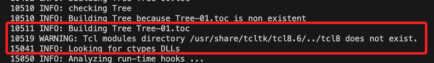

<br>

7. 第一次打包完成後，進入 `dist` 資料夾中運行一次看看。

    ```bash
    ./app
    ```

<br>

8. 假如正常運作只是沒音效就表示一切順利進行中。接著，開啟同樣位在根目錄下的 `app.spec` 檔案，找到以下部分。

    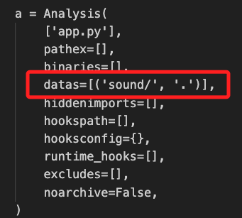

<br>

9. 將 `datas` 列表修改如下。

    ```ini
    datas=[('sound/*.mp3', 'sound')]
    ```

<br>

10. 進行 `第二次` 打包，直接使用前次生成的 `app.spec` 作為參數 。

    ```bash
    pyinstaller app.spec
    ```

<br>

11. 將 `dist` 資料夾內的 `app` 拖曳到專案的根目錄中運行一次。

    ```bash
    ./app
    ```

<br>

12. 確認音頻有正常播放，至此一切順利完成。接下來與之前作法相同，僅保留打包完成的主執行檔案其餘皆可刪除。

    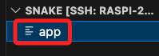

<br>

## 製作為桌面腳本

1. 下載任意圖片，這裡示範下載一個 256x256 像素的 png 圖檔 `snake.png` 。

    


<br>

2. 拖曳到專案根目錄內。

    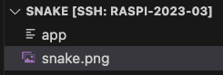

<br>

3. 授權遊戲腳本。

    ```bash
    sudo chmod +x app
    ```

<br>

4. 編輯桌面執行腳本。

    ```bash
    sudo nano ~/Desktop/snake.desktop
    ```

<br>

5. 寫入以下內容後存檔。

    ```ini
    [Desktop Entry]
    Type=Application
    Name=Snake Game
    Exec=/home/sam6238/Documents/Snake/app
    Icon=/home/sam6238/Documents/Snake/snake.png
    Comment=Start the Snake Game
    Terminal=false
    ```

<br>

6. 桌面添加一個應用，點擊即可啟動。

    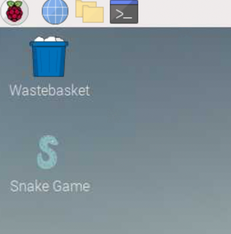

<br>

___

_END_