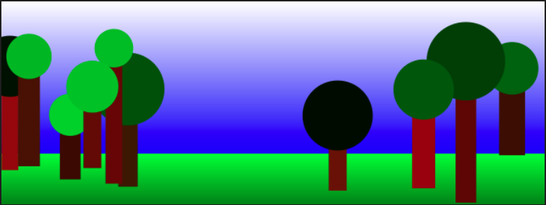
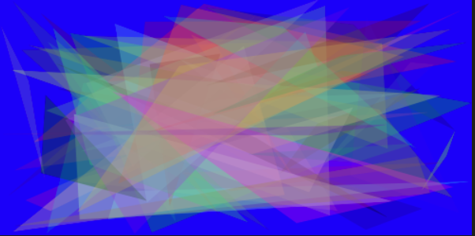

# PyCairo 

<br>

## 說明

1. PyCairo 模組用於建立 2D 圖形，它是 Cairo 圖形庫的 Python 綁定，允許用戶通過簡單的 Python 接口進行繪圖。

<br>

2. Cairo 支持多種輸出格式，包括 PNG、PDF、SVG 等。


<br>

## PyCairo 基本概念

1. Context（上下文）：繪圖的核心概念，控制顏色、線條厚度、字型等。

<br>

2. Surface：繪圖的目標載體，例如 PNG 圖像或 PDF 文件。

<br>

3. Path：由一系列的線條和曲線組成，可以填充或描線。


<br>

## 基礎

_建立簡單的圖形_

<br>

1. 安裝 Cairo 圖形庫

    ```bash
    sudo apt-get update -y
    sudo apt-get install libcairo2-dev pkg-config python3-dev
    ```

<br>

2. 安裝 Python 套件

    ```bash
    pip install pycairo
    ```

<br>

3. 範例：簡單的矩形

    
    
    ```python
    import cairo

    # 建立一個 Surface，指定大小和格式
    with cairo.ImageSurface(cairo.FORMAT_ARGB32, 280, 80) as surface:
        # 建立 Context
        context = cairo.Context(surface)
        
        # 設定繪圖顏色
        context.set_source_rgb(0, 0, 0) # 黑色

        # 繪製一個矩形
        context.rectangle(50, 20, 100, 40) # 矩形的 x, y, 寬, 高
        context.fill()

        # 將結果保存為 PNG
        surface.write_to_png("rectangle.png")
    ```

    

<br>

## 進階


1. 範例：繪製帶有文字的圖形

    

    ```python
    import cairo

    with cairo.ImageSurface(cairo.FORMAT_ARGB32, 400, 200) as surface:
        context = cairo.Context(surface)
        # 紅色
        context.set_source_rgb(1, 0, 0) 

        # 繪製一個圓形
        # 圓心 x, y, 半徑, 起始角度, 終止角度
        context.arc(200, 100, 50, 0, 2 * 3.14) 
        context.fill()

        # 文字繪製
        # 黑色
        context.set_source_rgb(0, 0, 0) 
        context.select_font_face(
            "Sans", 
            cairo.FONT_SLANT_NORMAL, 
            cairo.FONT_WEIGHT_NORMAL
        )
        context.set_font_size(40)
        # 文字位置
        context.move_to(150, 110) 
        context.show_text("Hello")

        surface.write_to_png("circle_text.png")
    ```

    

<br>

## 再進階

1. 繪製樹

    

    ```python
    # 引入所需的庫
    # cairo 用於繪圖
    import cairo
    # random 用於生成隨機數
    import random
    # math 用於數學運算
    import math

    # 圖片的寬度和高度
    width, height = 640, 240

    # 建立一個 Cairo 圖像表面（surface）
    surface = cairo.ImageSurface(cairo.FORMAT_ARGB32, width, height)
    # 使用表面建立一個 Cairo 上下文（context）
    ctx = cairo.Context(surface)

    # 為天空建立一個漸變矩形
    pat = cairo.LinearGradient(0.0, 0.0, 0.0, 0.75 * height)
    # 白色起始點
    pat.add_color_stop_rgba(0, 1.0, 1.0, 1.0, 1) 
    # 藍色終點
    pat.add_color_stop_rgba(1, 0.0, 0.0, 1.0, 1) 
    # 繪製矩形
    ctx.rectangle(0, 0, width, 0.75 * height) 
    ctx.set_source(pat)
    # 填充矩形
    ctx.fill() 

    # 為地面建立一個漸變矩形
    pat = cairo.LinearGradient(0.0, 0.75 * height, 0.0, 1.0 * height)
    # 綠色起始點
    pat.add_color_stop_rgba(0, 0.0, 1.0, 0.0, 1) 
    # 深綠色終點
    pat.add_color_stop_rgba(1, 0.0, 0.5, 0.0, 1) 
    # 繪製矩形
    ctx.rectangle(0, 0.75 * height, width, 0.25 * height) 
    ctx.set_source(pat)
    # 填充矩形
    ctx.fill() 

    # 建立一個隨機數生成器，範圍在 0 到 1 之間
    rnd = random.Random()

    # 生成一些隨機樹木
    for n in range(10):
        # 為樹木底部 (b) 隨機值
        b = (0.75 + 0.25 * rnd.random()) * height
        # 頂部 (t) 隨機值
        t = b - ((0.25 + 0.5 * rnd.random()) * height)
        # 水平中心 (x) 隨機值
        x = rnd.random() * width
        # 樹幹寬度 (w) 隨機值
        w = (0.025 + 0.025 * rnd.random()) * width
        # 樹冠半徑 (r) 
        r = w * (1.0 + 1.0 * rnd.random())

        # 繪製樹幹
        ctx.rectangle(x - w/2, b, w, t-b)
        ctx.set_source_rgb(0.2 + 0.4 * rnd.random(), 0.1 * rnd.random(), 0.0)
        # 填充矩形
        ctx.fill() 

        # 繪製樹冠
        ctx.arc(x, t, r, 0, 2 * math.pi)
        ctx.set_source_rgb(0.0, rnd.random(), 0.0)
        # 填充圓形
        ctx.fill() 

    # 將圖像輸出到 PNG
    surface.write_to_png("trees.png")
    ```

<br>

## 稍微高階


1. 這個腳本有很多函數可用在繪製生成圖像的應用。

<br>

2. 腳本中透過不同的繪圖庫（Nodebox、Cairo、Aggdraw）來繪製一系列多邊形，每個繪圖函數根據不同庫的接口定制，以產生相同的視覺效果，可自行透過開關註解調整主函數來使用特定的繪圖庫。

<br>

3. 程式碼

    

    ```python
    '''
    pip install aggdraw
    pip install pillow
    '''
    # 導入所需的庫
    import aggdraw
    from PIL import Image
    import cairo

    # 定義最小和最大透明度
    MIN_ALPHA = 50
    MAX_ALPHA = 100

    # 定義圖片的寬度和高度
    WIDTH = 500
    HEIGHT = 250

    # 工具函數定義
    def hex2tuple(hex_color):
        # 將十六進制顏色代碼轉換為元組
        return tuple([int(hex_color[i:i+2], 16) for i in range(1, 9, 2)])

    def tuple2hex(tuple_color):
        # 將顏色的元組轉換為十六進制代碼
        return "#%0.2X%0.2X%0.2X%0.2X" % tuple_color

    def ints2floats(tuple_color):
        # 將整數顏色值轉換為浮點數（用於Cairo）
        return tuple([c / 255.0 for c in tuple_color])

    def inc_point(p, dp):
        # 增加並包裹點的坐標
        return (p[0] + dp[0]) % WIDTH, (p[1] + dp[1]) % HEIGHT

    def inc_triangle(t, dt):
        # 增加並包裹三角形的坐標
        return tuple([inc_point(t[i], dt[i]) for i in range(3)])

    def inc_color(c, dc):
        # 增加並包裹顏色值
        new_c = [(c[i] + dc[i]) % 256 for i in range(3)]
        new_a = (c[3] + dc[3]) % MAX_ALPHA
        if new_a < MIN_ALPHA: new_a += MIN_ALPHA
        new_c.append(new_a)
        return tuple(new_c)

    def draw_all(draw_fn): 
        # 使用指定的繪圖函數繪製多個圖形
        triangle = start_t
        color = start_c
        for i in range(50):
            triangle = inc_triangle(triangle, dt)
            color = inc_color(color, dc)
            draw_fn(triangle, color)

    # 設置起始顏色和三角形的坐標，以及它們的增量
    start_c = hex2tuple('#E6A20644')
    start_t = (127, 132), (341, 171), (434, 125)
    dt = (107, 23), (47, 73), (13, 97)
    dc = 61, 113, 109, 41

    # 根據使用的繪圖工具箱定義的繪圖函數
    # 以下為 Nodebox、Cairo 和 Aggdraw 的具體實現

    def nodebox_poly(pts, clr):
        # Nodebox 的繪製多邊形函數
        fill(*ints2floats(clr))
        beginpath()
        moveto(*pts[-1])
        for pt in pts:
            lineto(*pt)
        endpath()

    def nodebox_main():
        # Nodebox 主函數
        size(500, 250)
        draw_all(nodebox_poly)

    def cairo_poly(pts, clr):
        # Cairo 的繪製多邊形函數
        ctx.set_source_rgba(*ints2floats(clr))
        ctx.move_to(*pts[-1])
        for pt in pts:
            ctx.line_to(*pt)
        ctx.close_path()
        ctx.fill()

    def cairo_main():
        # Cairo 主函數
        global ctx
        surface = cairo.ImageSurface(cairo.FORMAT_ARGB32, WIDTH, HEIGHT)
        ctx = cairo.Context(surface)
        # 填充背景為白色
        cairo_poly(((0,0),(WIDTH,0),(WIDTH,HEIGHT),(0,HEIGHT)),(255,255,255,255))
        draw_all(cairo_poly)
        surface.write_to_png('cairo_example.png')

    def aggdraw_poly(pts, clr):
        # Aggdraw 的繪製多邊形函數
        global ctx
        b = aggdraw.Brush(clr, clr[-1])
        pts2 = []
        for p in pts:
            pts2.extend(p)
        ctx.polygon(pts2, b)

    def aggdraw_main():
        # Aggdraw 主函數
        global ctx
        img = Image.new('RGBA', (WIDTH, HEIGHT), "white")
        ctx = aggdraw.Draw(img)
        draw_all(aggdraw_poly)
        ctx.flush()
        img.save('aggdraw_example.png')

    # 根據需要選擇使用的繪圖庫
    # nodebox_main()
    # cairo_main()
    aggdraw_main()
    ```

<br>

4. 舉個例子修改底色

        
    
    將以下的 `(255,255,255,255)` 改為 `(0,0,255,255)`
    ```python
    cairo_poly(
        ((0,0),(WIDTH,0),(WIDTH,HEIGHT),(0,HEIGHT)),
        (255,255,255,255)
    )
    ```
    改為
    ```python
    cairo_poly(
        ((0,0),(WIDTH,0),(WIDTH,HEIGHT),(0,HEIGHT)),
        (0,0,255,255)
    )
    ```

    <br>

    以及將以下的 `white` 改為 `blue`
    ```python
    img = Image.new('RGBA', (WIDTH, HEIGHT), "white")
    ```
    改為
    ```python
    img = Image.new('RGBA', (WIDTH, HEIGHT), "blue")
    ```


<br>

---

_END_