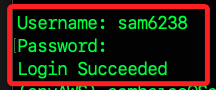
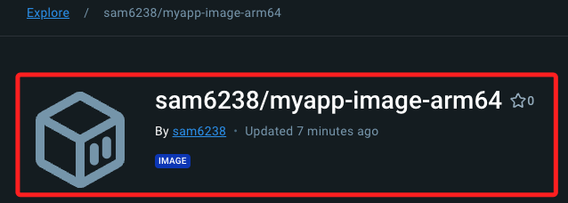

# 建立鏡像並推送到 Dockerhub

_以下示範建立並推送適用於樹莓派架構的映像到 Docker Hub_

<br>

1. 在本地建立建一個專案資料夾 `myapp`，將用於編輯 Docker 映像；完成後啟動 VSCode。

    ```bash
    cd ~/Documents && mkdir myapp && cd myapp && touch app.py requirements.txt Dockerfile && tree && code .
    ```

<br>

2. 架構如下。

    ```bash
    myapp/
    ├── app.py
    ├── requirements.txt
    └── Dockerfile
    ```

<br>

## 編寫腳本

1. 編輯應用程式的主腳本 `app.py`，這是一個簡單的 Flask 應用程式。

    ```python
    from flask import Flask, render_template_string

    app = Flask(__name__)

    bootstrap_template = """
    <!doctype html>
    <html lang="en">
    <head>
        <!-- Required meta tags -->
        <meta charset="utf-8">
        <meta name="viewport" content="width=device-width, initial-scale=1, shrink-to-fit=no">

        <!-- Bootstrap CSS -->
        <link href="https://stackpath.bootstrapcdn.com/bootstrap/4.5.2/css/bootstrap.min.css" rel="stylesheet">

        <title>My Kubernets App</title>
    </head>
    <body>
        <div class="container mt-5">
        <div class="row">
            <div class="col-md-12">
            <div class="card">
                <div class="card-header">
                Welcome
                </div>
                <div class="card-body">
                <h5 class="card-title">哈囉～你好。</h5>
                <p class="card-text">這是一個簡單的網頁應用</p>
                </div>
            </div>
            </div>
        </div>
        </div>

        <!-- Optional JavaScript -->
        <!-- jQuery first, then Popper.js, then Bootstrap JS -->
        <script src="https://code.jquery.com/jquery-3.5.1.slim.min.js"></script>
        <script src="https://cdn.jsdelivr.net/npm/@popperjs/core@2.5.4/dist/umd/popper.min.js"></script>
        <script src="https://stackpath.bootstrapcdn.com/bootstrap/4.5.2/js/bootstrap.min.js"></script>
    </body>
    </html>
    """


    @app.route("/")
    def hello_world():
        return render_template_string(bootstrap_template)


    if __name__ == "__main__":
        app.run(host="0.0.0.0", port=5001)
    ```

<br>

2. 在 `requirements.txt` 文件中，指定必要套件與版本。

    ```bash
    Flask==2.0.2
    werkzeug==2.0.3
    ```

<br>

3. 編輯容器文件 `Dockerfile` 以構建適用於 `ARM 架構` 的映像。

    ```dockerfile
    FROM python:3.9

    WORKDIR /usr/src/app

    COPY requirements.txt ./
    RUN pip install --no-cache-dir -r requirements.txt

    COPY . .

    CMD ["python", "./app.py"]
    ```

<br>

4. 若要在本地測試腳本，先安裝套件。

    ```bash
    pip install flask
    ```

<br>

5. 並將 port 指定為 `5001`；或是使用其他未被佔用的端口即可。

    ```python
    if __name__ == "__main__":
        app.run(host='0.0.0.0', port=5001)
    ```

<br>

6. 在專案資料夾中運行腳本。

    ```bash
    python app.py
    ```

<br>

## 進行推送

1. 啟動 Docker Desktop，運行以下指令；若出現警告 `WARNING: daemon is not using the default seccomp profile` 可不予理會。

    ```bash
    docker info
    ```

<br>

2. 登入 Docker Hub；注意這裡的 Username 是我的 `sam6238`，記下自己的名稱，在後續步驟會使用到。

    ```bash
    docker login
    ```

    

<br>

3. 在 `myapp` 目錄中構建 Docker 映像。

    ```bash
    docker build -t sam6238/myapp-image-arm64:latest .
    ```

<br>

4. 確認成功後，將構建好的映像推送到 Docker Hub；其中 `sam6238` 是我的帳號名稱，務必更換為自己的 Docker Hub 帳戶名稱。

    ```bash
    docker push sam6238/myapp-image-arm64:latest
    ```

    

<br>

## 修正鏡像

1. 修正腳本後，先進行重構。

    ```bash
    docker build -t sam6238/myapp-image-arm64 .
    ```

<br>

2. 重新推送。

    ```bash
    docker push sam6238/myapp-image-arm64
    ```

<br>

## 刪除本地映像

1. 刪除本地映像。

```bash
docker rmi sam6238/myapp-image-arm64:latest
```

## 刪除 Docker Hub 上的映像

_使用 Docker Hub 的 API 進行刪除映像_

<br>

1. 獲取 Docker Hub 的 access token，替換其中 `<username>` 和 `<password>` 為自己的 Docker Hub 用戶名和密碼。

    ```bash
    TOKEN=$(curl -s -u <帳號名稱>:<密碼> https://hub.docker.com/v2/users/login/ | jq -r .token)

    ```

<br>

2. 使用前一個步驟得到的 access token 來刪除指定的映像。

    ```bash
    curl -X DELETE -H "Authorization: JWT <token>" https://hub.docker.com/v2/repositories/<帳戶名稱>/<Hub 名稱>/tags/<標籤號>/
    ```

    _例如_

    ```bash
    curl -X DELETE -H "Authorization: JWT $TOKEN" https://hub.docker.com/v2/repositories/sam6238/myapp-image-arm64/tags/latest/
    ```

<br>

___

_END_