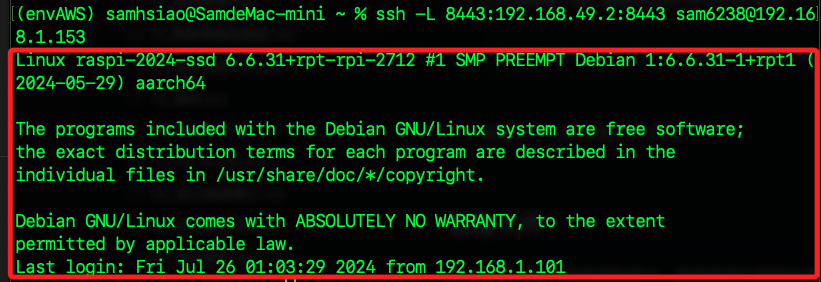
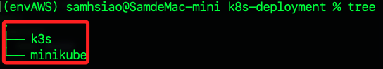
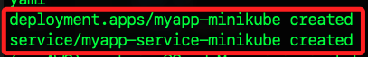
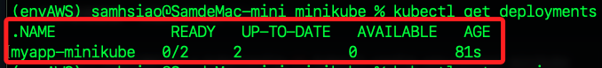
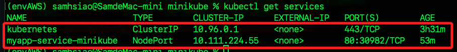

_尚未驗證_

# 集群間的通訊測試

<br>

## 部署目標

1. 將應用程序部署到樹莓派 A 上的 Minikube 集群和樹莓派 B 上的 K3s 集群。

<br>

2. 確保這兩個集群能夠協作運作，進行通信。

<br>

## 樹莓派 A

1. Minikube 集群

<br>

2. IP 地址：192.168.1.153

<br>

3. Kubernetes API IP：192.168.49.2

<br>

## 樹莓派 B

1. K3s 集群

<br>

2. IP 地址：192.168.1.154

<br>

3. Kubernetes API IP：查詢並設置

<br>

## 本機（MacOS）準備工作

1. 在本機開啟 SSH 通道；在此期間，本機可以通過 `localhost:8443` 訪問樹莓派 A 上的 Minikube API 服務。

    ```bash
    ssh -L 8443:192.168.49.2:8443 sam6238@192.168.1.153
    ```

    

<br>

2. 樹莓派 B 可直接使用 IP 訪問。

<br>

3. 建立並進入專案資料夾。

    ```bash
    mkdir -p ~/Desktop/k8s-deployment/minikube ~/Desktop//k8s-deployment/k3s && cd ~/Desktop/k8s-deployment
    ```

    

<br>

4. 添加兩個部署文件，並使用 VSCode 開啟。

    ```bash
    touch minikube/deployment_minikube.yaml k3s/deployment_k3s.yaml && code .
    ```

<br>

## 編輯部署文件

_將應用程序部署到兩個集群中，確保兩者的服務能夠互相通信_

<br>

1. Minikube 部署文件 (`deployment_minikube.yaml`)。

```yaml
apiVersion: apps/v1
kind: Deployment
metadata:
  name: myapp-minikube
spec:
  replicas: 2
  selector:
    matchLabels:
      app: myapp
  template:
    metadata:
      labels:
        app: myapp
    spec:
      containers:
      - name: myapp-container
        image: myapp-image:latest
        ports:
        - containerPort: 80
---
apiVersion: v1
kind: Service
metadata:
  name: myapp-service-minikube
spec:
  selector:
    app: myapp
  ports:
    - protocol: TCP
      port: 80
      targetPort: 80
  type: LoadBalancer
```

<br>

2. K3s 部署文件 (`deployment_k3s.yaml`)。

```yaml
apiVersion: apps/v1
kind: Deployment
metadata:
  name: myapp-k3s
spec:
  replicas: 2
  selector:
    matchLabels:
      app: myapp
  template:
    metadata:
      labels:
        app: myapp
    spec:
      containers:
      - name: myapp-container
        image: myapp-image:latest
        ports:
        - containerPort: 80
---
apiVersion: v1
kind: Service
metadata:
  name: myapp-service-k3s
spec:
  selector:
    app: myapp
  ports:
    - protocol: TCP
      port: 80
      targetPort: 80
  type: LoadBalancer
```

<br>

## 部署到 Minikube

_在本機上運行以下指令來部署應用程序_

<br>

1. 設定環境變數，切換上下文到 Minikube。

    ```bash
    export KUBECONFIG=~/.kube/config && kubectl config use-context minikube
    ```

<br>

2. 部署應用程序。

    ```bash
    kubectl apply -f deployment_minikube.yaml
    ```

    

<br>

3. 確認部署。

    ```bash
    kubectl get deployments
    ```

    

<br>

4. 確認服務。

    ```bash
    kubectl get services
    ```

    

<br>

## 部署到 K3s

1. 設定環境變數，切換上下文到 K3s；這裡特別注意，在取回的設定文件中，k3s 預設上下文的名稱是 `default`，所以指令要指定為 `default`。

    ```bash
    export KUBECONFIG=~/.kube/config_k3s && kubectl config use-context default
    ```

<br>

2. 部署應用程序。

    ```bash
    kubectl apply -f deployment_k3s.yaml
    ```

<br>

3. 確認部署；特別注意，確認部署的指令對於兩個容器是相同的，所以需要透過切換上下文的方式來進行以確保在檢查的是正確的集群。

    ```bash
    kubectl get deployments
    ```

<br>

4. 確認服務。

    ```bash
    kubectl get services
    ```

<br>

## 確認兩個集群間的通信

1. 部署完畢後，可以測試兩個集群之間的通信；在本機運行以下指令，測試從 Minikube 集群訪問 K3s 集群中的服務。

    ```bash
    kubectl run curl --image=radial/busyboxplus:curl -i --tty --rm
    curl myapp-service-k3s.default.svc.cluster.local
    ```

<br>

## 配置持久化

_各項測試都通過時，可將設定寫入文件中以建立持久化設置_

<br>

1. 確保環境變數設置持久化，可將以下內容添加到 `.zshrc` 或 `.bashrc` 文件中。

    ```bash
    # Minikube
    alias minikube-config="export KUBECONFIG=~/.kube/config"

    # K3s
    alias k3s-config="export KUBECONFIG=~/.kube/config_k3s"
    ```

<br>

___

_END_