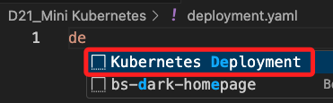
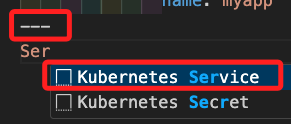

## 步驟

1. 建立一個部署文件 `deployment.yaml`，定義應用的基本資訊；這些資訊包含了應用由哪些 `Pod` 組成、運行哪些容器、網路配置訊息；輸入部分關鍵字後，按下 `TAB` 鍵即可自動補全。



2. 初次補全後的內容如下，這是一個最基本的配置，其中 `myapp` 是預設的應用名稱，可對其重新命名。

```yaml
apiVersion: apps/v1
kind: Deployment
metadata:
    name: myapp
spec:
    selector:
        matchLabels:
        app: myapp
    template:
        metadata:
        labels:
            app: myapp
        spec:
            containers:
                - name: myapp
                image: <Image>
                resources:
                    limits:
                        memory: "128Mi"
                        cpu: "500m"
                ports:
                - containerPort: <Port>
```

3. 編輯配置文件：添加參數 `replices`，這是連同備用 Pod 在內的所有 Pod 數量。

```yaml
spec:
    replices: 2
```

4. 使用這個鏡像來源 `rossning92/finance`。


5. 編輯腳本中的鏡像來源，使用範例鏡像名稱 `image: rossning92/finance`；另外在 `limits` 部分可為每個 Pod 配置合適的記憶體及 CPU 配額；`- containerPort:` 是容器的對外端口，這個是網頁應用，所以設立為 `5000`。

```yaml
spec:
    selector:
        matchLabels:
        app: myapp
    template:
        metadata:
        labels:
            app: myapp
        spec:
        containers:
        - name: myapp
            image: rossning92/finance
            resources:
                limits:
                    memory: "128Mi"
                    cpu: "500m"
            ports:
                - containerPort: 5000
                name: myapp
```

6. 添加編輯內容，先使用 YAML 語法三個橫線 `---` 來表示列表，接的輸入 `Service`，可透過部分的關鍵字來自動補全。



```yaml
---
apiVersion: v1
kind: Service
metadata:
  name: myapp
spec:
  selector:
    app: myapp
  ports:
  - port: <Port>
    targetPort: <Target Port>
```

7. 添加 `type: NodePort` 等，修改如下。

```yaml
apiVersion: v1
kind: Service
metadata:
  name: myapp-finance
spec:
  selector:
    app: myapp
  type: NodePort
  ports:
  - port: 5000
    targetPort: 5000
```


## 應用部署

_使用 kubctl 命令行工具_

1. 部署。

```bash
kubctl apply -f deployment.yaml
```

___

_END_