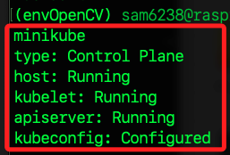

# 安裝 MiniKube

_MiniKube 是一個用於本地 Kubernetes 集群的工具，它適合在開發環境中使用，以下在樹莓派 A 進行安裝_

<br>

## 更新並安裝 Docker

1. 更新樹莓派系統。

    ```bash
    sudo apt update && sudo apt upgrade -y && sudo apt autoremove -y
    ```

<br>

2. 確認是否安裝了 Docker。

    ```bash
    docker -v
    ```

<br>

3. 假如還沒安裝 Docker 則進行安裝；因為 `MiniKube` 依賴於 `Docker` 作為容器運行，所以一定要先安裝 Docker。

    ```bash
    curl -fsSL https://get.docker.com -o get-docker.sh && sudo sh get-docker.sh
    ```

<br>

4. 檢查當前用戶群組。

    ```bash
    groups sam6238
    ```

<br>

5. 假如 `當前用戶` 不在群組 Group 內，則將其加入。

    ```bash
    sudo usermod -aG docker $USER
    ```

6. 可退出終端機重新登入讓授權生效。

<br>

## 安裝 MiniKube

1. 安裝 MiniKube：下載並安裝 MiniKube 的二進制文件。

    ```bash
    curl -Lo minikube https://storage.googleapis.com/minikube/releases/latest/minikube-linux-arm64
    ```

<br>

2. 添加執行權限。

    ```bash
    chmod +x minikube
    ```

<br>

3. 將執行文件搬移到系統路徑 `/usr/local/bin/` 中。

    ```bash
    sudo mv minikube /usr/local/bin/
    ```

<br>

4. 使用 Docker 作為驅動器啟動 MiniKube；無參數時效果與參數 `--driver=docker` 相同，都會在容器中啟動。

    ```bash
    minikube start
    ```

    

<br>

5. 檢查 MiniKube 狀態，確認 MiniKube 已經成功啟動並運行。

    ```bash
    minikube status
    ```

    

<br>

6. 檢查容器 IP。

    ```bash
    minikube ip
    ```

    _輸出_

    ```bash
    192.168.49.2
    ```

<br>

## 新增橋接 IP

1. 安裝了 Minikube 之後會添加一個橋接 IP `192.168.49.1/24`，這是 Minikube 建立的虛擬網路，用於管理 Kubernetes 集群內的 Pod 和服務之間的通信；Minikube 使用這個網路來分配 Kubernetes 集群內部的 IP 地址，確保 Pod 和服務之間的通信不受外部網路影響；使用 `kubectl` 指令時，Kubeconfig 文件中的 server 會指向這個網路的 IP 地址，通常是 Minikube 容器的 IP，例如 `192.168.49.2`。

2. 安裝了 Docker 之後會添加一個橋接 IP `172.17.0.1/16`，這是 Docker 預設建立的橋接網路，用於管理 Docker 容器之間的通信。

___

_END_