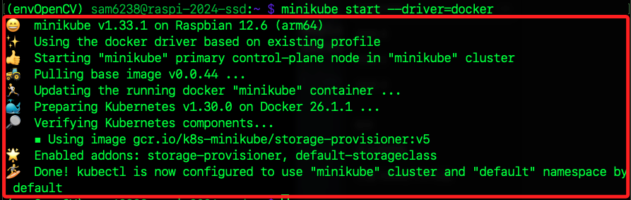
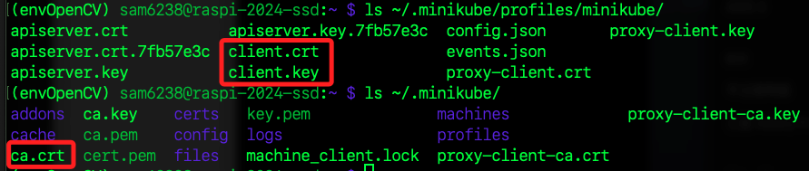
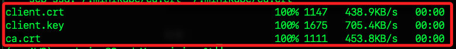
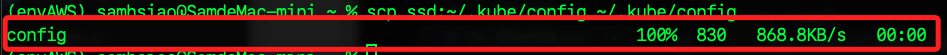
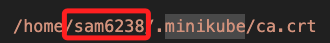
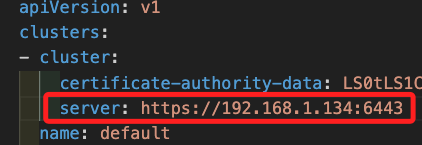

# 與 Minikube 連線

_以下是本機嘗試連線樹莓派 A_

<br>

## 樹莓派 A

_運行 Minikube_

<br>

1. 樹莓派 A 啟動 Minikube；使用參數 `--driver=none` 會直接在本地機器樹莓派 A 上運行，而不使用虛擬機；若要使用虛擬網卡可用參數 `--driver=docker`，預設也會在容器中啟動。

    ```bash
    minikube start
    ```

    

<br>

2. 確認 Minikube 狀態。

    ```bash
    minikube status
    ```

    

<br>

3. 確認 IP。

    ```bash
    minikube ip
    ```

<br>

## 證書文件

_樹莓派 A 上的證書文件_

<br>

1. 檢查並確認證書文件是否存在於樹莓派 A，以下指令分開兩次執行，用以明確觀察證書所在路徑。

    ```bash
    ls ~/.minikube/profiles/minikube/
    ls ~/.minikube/
    ```

    _要確認這三個文件的位置_

    

<br>

2. 確認文件存在後準備進行複製，先在 MacOS 上建立目標目錄；建立之前可先檢查 `~/.minikube/profiles/minikube` 文件是否存在，若有殘餘資料可先將其刪除。

    ```bash
    mkdir -p ~/.minikube/profiles/minikube
    ```

<br>

3. 使用 scp 將三個證書文件從樹莓派 A 複製到 MacOS。

    ```bash
    scp ssd:~/.minikube/profiles/minikube/client.crt ~/.minikube/profiles/minikube/client.crt
    scp ssd:~/.minikube/profiles/minikube/client.key ~/.minikube/profiles/minikube/client.key
    scp ssd:~/.minikube/ca.crt ~/.minikube/ca.crt
    ```

    _務必確保文件正常複製_

    

<br>

4. 使用以下指令確定複製完成。

    ```bash
    ls ~/.minikube/profiles/minikube/client.crt
    ls ~/.minikube/profiles/minikube/client.key
    ls ~/.minikube/ca.crt
    ```

<br>

## 查看 Minikube 狀態與 IP

1. 確認在樹莓派 A 上已經啟動並運行了 Minikube。

    ```bash
    minikube status
    ```

    _輸出_

    ```bash
    minikube
    type: Control Plane
    host: Running
    kubelet: Running
    apiserver: Running
    kubeconfig: Configured
    ```

<br>

2. 在樹莓派 A 上確認 Minikube 的 IP 地址。

    ```bash
    minikube ip
    ```

    _輸出_

    ```bash
    192.168.49.2
    ```

<br>

3. 這是 Kubernetes 集群內的 Pod 和服務之間通信的網段，若試圖從 MacOS 連線這個 IP 地址是無法連線的。

    ```bash
    ping 192.168.49.2
    ```

<br>

## 複製 Minikube 配置文件到 MacOS

_從樹莓派將配置文件複製到本機電腦上_

<br>

1. 在樹莓派 A 檢查所需的設定文件已經存在。

    ```bash
    ls ~/.kube/config
    ```

<br>

2. 在本地電腦 MacOS 上建立目標目錄。

    ```bash
    mkdir -p ~/.kube
    ```

<br>

3. 在 MacOS 上運行以下指令從樹莓派 A 複製 Minikube 的 kubeconfig 文件到 MacOS。

    ```bash
    scp ssd:~/.kube/config ~/.kube/config
    ```

    

<br>

4. 在本機電腦確認複製確實完成。

    ```bash
    ls ~/.kube/config
    ```

<br>

5. 在 MacOS 設置 Minikube 環境變數；這是暫時性的，系統重啟便會失效，若要持久生效則需寫入環境變數文件中如 `~/.zshrc`。

    ```bash
    export KUBECONFIG=~/.kube/config
    ```

<br>

## 編輯設定文件

1. 查看本機使用者的家目錄絕對路徑 `/Users/samhsiao`；可在任何路徑中透過 `pwd` 查看路徑前綴即可。

    

<br>

2. 編輯 Kubeconfig 文件 `~/.kube/config`， 將其中的路徑指向 MacOS 上的正確位置，原本是樹莓派上的文件路徑，要將其改為本機電腦上的路徑；可先確認資料 `~/.kube/config` 存在。

    ```bash
    code ~/.kube/config
    ```

<br>

3. 將其中的使用者家目錄從樹莓派的 `/home/sam6238` 改為本機用戶的家目錄 `/Users/samhsiao`；再次強調，務必詳細檢查。

    

<br>

4. 將其中的 `server` 改為 `localhost:8443`，這將用在後續 `端口轉發` 時的本地端口。

    ```bash
    server: https://localhost:8443
    ```

    

<br>

5. 開啟通道，這個通道不可關閉；設定後可通過 SSH 通道訪問遠程服務，而不需要直接暴露遠程服務的端口。

    ```bash
    ssh -L 8443:192.168.49.2:8443 ssd
    ```

<br>

## 關於開啟通道

_開啟通道也稱為 `SSH 端口轉發`，其工作原理是通過 `SSH 通道` 將本地主機上的指定端口 `8443` 轉發到樹莓派遠的端口 `192.168.49.2:8443`，設定後，本地應用程序可以通過訪問本地端口來訪問遠端樹莓派主機上的服務_

<br>

1. `ssh`：啟動 SSH 客戶端。

<br>

2. `-L`：設置本地端口轉發的參數，後面接著轉發的設定值，依序是 `本地端口 : 遠程位置及端口`。

<br>

3. `8443`：第一個值是本地端口。

<br>

4. `192.168.49.2:8443`：第二個值是遠程樹莓派主機的目標 IP 和端口。

<br>

5. `ssd`：一般 SSH 連線時使用的樹莓派 SSH 別名或地址。

<br>

## 繼續連線

1. 在 MacOS 運行指令切換連線。

    ```bash
    kubectl config use-context minikube
    ```

    _輸出_

    ```bash
    Switched to context "minikube".
    ```

<br>

2. 連線測試；確認連接是否成功，以下訊息表示 Minikube 集群已經成功運行，節點 `minikube` 處於 Ready 狀態，並且運行了 3 小時 45 分鐘，Kubernetes 的版本是 `v1.30.0`；確認了 Minikube 安裝和配置是正確的，並且節點已經準備好接收和運行工作負載。

    ```bash
    kubectl get nodes
    ```

    _輸出_

    ```bash
    NAME       STATUS   ROLES           AGE     VERSION
    minikube   Ready    control-plane   3h45m   v1.30.0
    ```

<br>

___

_END_
