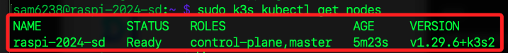
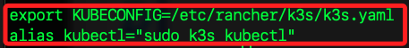

# 安裝 K3s

_K3s 是一個輕量級的 Kubernetes 發行版，專為低資源設備設計，非常適合在樹莓派上運行_

<br>

## 環境設置 memory cgroup

_K3s 安裝前需要先設置環境，否則會出現錯誤_

<br>

1. 樹莓啟用 memory cgroup，否則會出現以下錯誤。

    ```bash
    Failed to find memory cgroup, you may need to add "cgroup_memory=1 cgroup_enable=memory" to your linux cmdline (/boot/cmdline.txt on a Raspberry Pi)
    ```

<br>

2. 編輯 `/boot/firmware/cmdline.txt` 文件。

    ```bash
    sudo nano /boot/firmware/cmdline.txt
    ```

<br>

3. 在文件內容的 `尾端` 添加以下參數，特別注意，務必確保這些參數與其他參數在同一行，然後保存 `Ctrl+O` 並退出 `Ctrl+X`。

    ```bash
    cgroup_memory=1 cgroup_enable=memory
    ```

<br>

4. 重啟系統使更改生效。

    ```bash
    sudo reboot
    ```

<br>

## 環境設置 iptables 

1. 同樣需安裝相關依賴，才可避免如下所示的錯誤。

    ```bash
    Host iptables-save/iptables-restore tools not found
    Host ip6tables-save/ip6tables-restore tools not found
    ```

<br>

2. 更新並安裝以下依賴工具。

    ```bash
    sudo apt-get update && sudo apt-get install -y iptables
    ```

<br>

3. 查看 K3s 服務狀態。

    ```bash
    sudo systemctl status k3s.service
    ```

<br>

4. 查看 K3s 服務日誌；可添加參數 `-n 5` 來限制顯示筆數；其他參數 `-x` 顯示擴展的說明信息，提供更多關於日誌條目的詳細資訊；參數 `-e` 將輸出移動到日誌的末尾；參數 `-u k3s.service` 只顯示與 k3s.service 相關的日誌。

    ```bash
    sudo journalctl -xeu k3s.service -n 5
    ```

<br>

## 安裝 K3S

1. 確保樹莓派運行的是最新的 Raspbian 操作系統，並安裝所有最新的更新。

    ```bash
    sudo apt update && sudo apt upgrade -y
    ```

<br>

2. 安裝 K3s：以下是直接使用官方的安裝腳本安裝 K3s。

    ```bash
    curl -sfL https://get.k3s.io | sh -
    ```

<br>

3. 檢查 K3s 狀態：確認 K3s 已經成功安裝並運行。

    ```bash
    sudo k3s kubectl get nodes
    ```

    

<br>

## 配置環境參數

1. 添加文件內容以配置 kubectl，設置 kubectl 命令來管理 K3s 集群，這需要設置環境變數 KUBECONFIG，指向 K3s 的配置文件。

    ```bash
    echo 'export KUBECONFIG=/etc/rancher/k3s/k3s.yaml' >> ~/.bashrc && echo 'alias kubectl="sudo k3s kubectl"' >> ~/.bashrc
    ```

<br>

2. 立即加載。

    ```bash
    source ~/.bashrc
    ```

<br>

3. 透過這樣的設置，內容會添加在文件最下面。

    

<br>

___

_END_