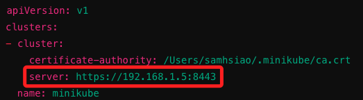

# 建立橋接模式

_要從本機 MacOS（192.168.1.101）訪問樹莓派（192.168.1.153）的 Kubernetes 集群（容器內部 IP 為 192.168.49.2），若不使用 SSH 端口轉發，也可透過建立橋接路由達成。_

<br>

## 工作原理

1. 使用 `橋接網路模式` 可使 `Docker 容器` 與 `樹莓派主機` 在同一網段內，這樣 `本機電腦` 就可以直接訪問 Kubernetes 集群的 IP 地址，而不需要使用 SSH 端口轉發。

<br>

## 建立步驟

_使用橋接網路模式來配置 Docker，使得容器和主機在同一個網段內，這樣本機就可以直接訪問 Kubernetes 集群的 IP 地址_

<br>

1. 停止當前的 Minikube 集群。

    ```bash
    minikube stop && minikube delete
    ```

<br>

2. 配置 Docker 使用橋接網路，編輯 Docker 的 `daemon.json` 文件，這個文件是用於配置 Docker 守護進程的參數；如果不存在，則建立它。

    ```bash
    sudo nano /etc/docker/daemon.json
    ```

<br>

3. 選定一個 IP，比如說 `192.168.1.5`，進行測試確認無響應。

    ```bash
    ping 192.168.1.5
    ```

<br>

4. 添加以下內容，這會將 Docker 的預設橋接網路配置為 `192.168.1.5`，鍵名就是 `橋接 IP` 的意思。

    ```json
    {
      "bip": "192.168.1.5/24"
    }
    ```

<br>

5. 修改設定文件後都要重啟 Docker 來套用變更。

    ```bash
    sudo systemctl restart docker
    ```

<br>

6. 重新啟動 Minikube；參數 `--driver=docker` 明確指定使用 Docker 作為 Minikube 的驅動程序；不顯式指定時，Minikube 會根據系統環境和已安裝的驅動程序自動選擇一個合適的驅動程序，常用的程序除 Docker 外，還有 `KVM2`、`VirtualBox`、`QEMU2`、`VMWare` 等。

    ```bash
    minikube start --driver=docker
    ```

<br>

7. 在橋接網路模式下，先查詢容器的 ID。

    ```bash
    docker ps
    ```

<br>

8. 使用容器 ID 查詢其 IP 地址。

    ```bash
    docker inspect -f '{{range .NetworkSettings.Networks}}{{.IPAddress}}{{end}}' <container_id>
    ```

<br>

9. 編輯 MacOS 本機上的 `~/.kube/config` 文件，將 `server` 欄位更新為前一個步驟查詢到的 Minikube 容器 IP 地址；假如使用的是 `192.168.1.5`。

    

<br>

## 測試

1. 在 MacOS 上運行以下命令以確認配置是否正確。

    ```bash
    kubectl config use-context minikube
    ```

<br>

2. 連接節點。

    ```bash
    kubectl get nodes
    ```

<br>

___

_END_
