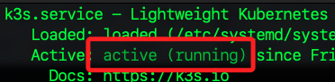
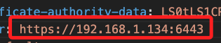

# 本機連線 k3s

_接下來連線 MacOS 及 樹莓派 B_

<br>

## 樹莓派 B

_運行 k3s_

<br>

1. 啟動 k3s 服務。

   ```bash
   sudo systemctl start k3s
   ```

<br>

2. 確認 k3s 服務狀態。

   ```bash
   sudo systemctl status k3s
   ```

   

<br>

3. 啟用 k3s 開機自動啟動。

   ```bash
   sudo systemctl enable k3s
   ```

<br>

4. 列出 Kubernetes 集群中的所有節點（nodes）。

   ```bash
   sudo k3s kubectl get nodes
   ```

   

<br>

## 配置 MacOS 與 k3s 的連接

1. 檢查樹莓派 B 上的 k3s kubeconfig 文件是否確實存在。

   ```bash
   ls /etc/rancher/k3s/k3s.yaml
   ```

<br>

2. 在 MacOS 運行以下指令，從樹莓派 B 複製 k3s 的 kubeconfig 文件到 MacOS；特別注意，這裡與前面略有不同之處在於 `/etc` 文件需要 root 權限來讀取，但 scp 命令是不支持直接使用 sudo 的，所以要透過 SSH 通道來實現。

   ```bash
   ssh sd "sudo cat /etc/rancher/k3s/k3s.yaml" > ~/.kube/config_k3s
   ```

<br>

3. 檢查本機是否正確複製了文件；以下指令會使用 VSCode 開啟文件，暫時不用關閉。

   ```bash
   code ~/.kube/config_k3s
   ```

<br>

4. 設置環境變量 KUBECONFIG，使 kubectl 命令使用指定的 Kubernetes 配置文件；也就是要在 MacOS 使用 kubectl 連接和操作特定的 Kubernetes 集群；特別注意，這並非持久化的設定。

   ```bash
   export KUBECONFIG=~/.kube/config_k3s
   ```

<br>

## 確認樹莓派 IP 設置 

1. 確認樹莓派 B 的 IP。

   ```bash
   hostname -I
   ```

   _輸出_

   ```bash
   192.168.1.134 192.168.1.135 10.42.0.0 10.42.0.1 
   ```

<br>

3. 在 MacOS 進行連線測試。

   ```bash
   ping 192.168.1.134
   ```

<br>

4. 編輯 MacOS 上的設定文件 `~/.kube/config_k3s`；假如還沒關閉，可直接進入編輯。

   ```bash
   code ~/.kube/config_k3s
   ```

<br>

5. 修正其中 `server` 的 IP 為樹莓派 B 的真實 IP，這裡是 `192.168.1.134`；端口部分不用變動，因為這個設置文件是從樹莓派設定上複製過來的，暫時保持原有設定值即可。

   

<br>

6. 在本機運行以下指令，確認節點連接狀態。

   ```bash
   kubectl get nodes
   ```   

   _完成_

   

<br>

___

_END_
