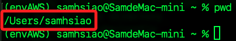
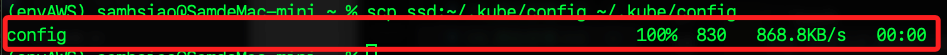

# 與 Minikube 連線

_以下將嘗試建立三台設備的運行架構，包含一台 MacOS與兩台樹莓派_

<br>

## 樹莓派 A

_運行 Minikube_

<br>

1. 樹莓派 A 啟動 Minikube；使用參數 `--driver=none` 會直接在本地機器樹莓派 A 上運行，而不使用虛擬機；若要使用虛擬網卡可用參數 `--driver=docker`。

    ```bash
    minikube start --driver=docker
    ```

    

<br>

2. 確認 Minikube 狀態。

    ```bash
    minikube status
    ```

    

<br>

## 證書文件

_樹莓派 A 上的證書文件_

<br>

1. 檢查並確認證書文件是否存在於樹莓派 A。

    ```
    ls ~/.minikube/profiles/minikube/
    ls ~/.minikube/
    ```

    _要確認這三個文件的位置_

    

<br>

2. 確認文件存在後準備進行複製，先在 MacOS 上建立目標目錄。

    ```bash
    mkdir -p ~/.minikube/profiles/minikube
    ```

<br>

3. 使用 scp 將三個證書文件從樹莓派 A 複製到 MacOS。

    ```bash
    scp ssd:~/.minikube/profiles/minikube/client.crt ~/.minikube/profiles/minikube/client.crt
    scp ssd:~/.minikube/profiles/minikube/client.key ~/.minikube/profiles/minikube/client.key
    scp ssd:~/.minikube/ca.crt ~/.minikube/ca.crt
    ```

<br>

4. 查看本機使用者家的目錄 `/Users/samhsiao`。

    

<br>

5. 編輯 Kubeconfig 文件 `~/.kube/config` 中的路徑，使其指向 MacOS 上的正確位置。

    ```bash
    code ~/.kube/config
    ```

<br>

6. 將其中的使用者家目錄從樹莓派的 `/home/sam6238` 改為本機用戶的家目錄 `/Users/samhsiao`。

    

<br>

## 配置 MacOS 與 Minikube 的連接

1. 在樹莓派 A 檢查設定文件確實存在。

    ```bash
    ls ~/.kube/config
    ```

<br>

2. 確認在樹莓派 A 上已經啟動並運行了 Minikube。

    ```bash
    minikube status
    ```

    _輸出_

    ```bash
    minikube
    type: Control Plane
    host: Running
    kubelet: Running
    apiserver: Running
    kubeconfig: Configured
    ```

<br>

3. 在樹莓派 A 上確認 Minikube 的 IP 地址。

    ```bash
    minikube ip
    ```

    _輸出_

    ```bash
    192.168.49.2
    ```

<br>

4. 試圖從 MacOS 連線 Minikube 的 IP 地址，確保網絡連接正常。

    ```bash
    ping 192.168.49.2
    ```

5. 在本地電腦 MacOS 上建立目標目錄。

    ```bash
    mkdir -p ~/.kube
    ```

6. 在 MacOS 上運行以下指令從樹莓派 A 複製 Minikube 的 kubeconfig 文件到 MacOS。

    ```bash
    scp ssd:~/.kube/config ~/.kube/config
    ```

    

<br>

7. 在 MacOS 設置 Minikube 環境變數。

    ```bash
    export KUBECONFIG=~/.kube/config
    ```

<br>

8. 進行連接。

    ```bash
    kubectl config use-context minikube
    ```

    _輸出_

    ```bash
    Switched to context "minikube".
    ```

<br>

9. 確認連接是否成功，以下訊息表示 Minikube 集群已經成功運行，節點 `minikube` 處於 Ready 狀態，並且運行了 3 小時 45 分鐘，Kubernetes 的版本是 `v1.30.0`；確認了 Minikube 安裝和配置是正確的，並且節點已經準備好接收和運行工作負載。

    ```bash
    kubectl get nodes
    ```

    _輸出_

    ```bash
    NAME       STATUS   ROLES           AGE     VERSION
    minikube   Ready    control-plane   3h45m   v1.30.0
    ```

<br>

## 其他指令

1. 停止並刪除 Minikube 服務。

    ```bash
    minikube stop && minikube delete
    ```

    

<br>

2. 重新啟動 Minikube 服務。

    ```bash
    minikube start --driver=docker
    ```

<br>

___

_END_
