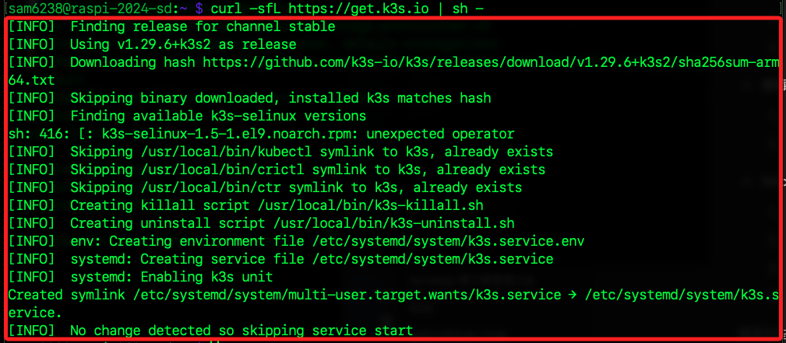

# K3s

## 樹莓派 B

_運行 K3s_

1. 樹莓派 B 啟動 K3s。

    ```bash
    curl -sfL https://get.k3s.io | sh -
    ```

    

2. 確認 K3s 狀態。

    ```bash
    sudo k3s kubectl get nodes
    ```

    

### 4. 配置 MacOS 與 K3s 的連接

#### 步驟：
1. 在 MacOS 上配置 K3s 上下文：
   - 從樹莓派 B 複製 K3s 的 kubeconfig 文件到 MacOS。
     ```bash
     scp pi@<Raspberry_Pi_B_IP>:/etc/rancher/k3s/k3s.yaml ~/.kube/config_k3s
     ```

2. 設置 K3s 上下文：
   ```bash
   export KUBECONFIG=~/.kube/config_k3s
   ```

3. 確認連接：
   ```bash
   kubectl get nodes
   ```

### 5. 在 MacOS 上部署應用到 Minikube

#### 步驟：
1. 切換到 Minikube 上下文：
   ```bash
   export KUBECONFIG=~/.kube/config_minikube
   kubectl config use-context minikube
   ```

2. 部署應用：
   將你的腳本保存到一個文件（例如 `deployment.yaml`），然後應用該文件：
   ```bash
   kubectl apply -f deployment.yaml
   ```

3. 確認部署：
   ```bash
   kubectl get deployments
   kubectl get services
   ```

### 6. 在 MacOS 上部署應用到 K3s

#### 步驟：
1. 切換到 K3s 上下文：
   ```bash
   export KUBECONFIG=~/.kube/config_k3s
   ```

2. 部署應用：
   使用同樣的腳本文件：
   ```bash
   kubectl apply -f deployment.yaml
   ```

3. 確認部署：
   ```bash
   kubectl get deployments
   kubectl get services
   ```

### 小結

- 樹莓派 A（Minikube）：
  1. 啟動 Minikube。
  2. 確認 Minikube 狀態。

- 樹莓派 B（K3s）：
  1. 啟動 K3s。
  2. 確認 K3s 狀態。

- MacOS：
  1. 配置與 Minikube 的連接。
  2. 配置與 K3s 的連接。
  3. 在 Minikube 上部署應用。
  4. 在 K3s 上部署應用。

通過這些步驟，你可以在三台設備之間協同工作，並在 MacOS 上管理和部署應用到安裝了 Minikube 和 K3s 的樹莓派。