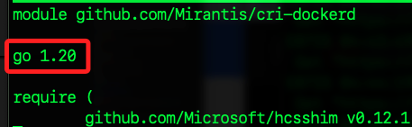
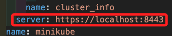

# 本機連線 K3s

_接下來連線 MacOS 及 樹莓派 B_

<br>

## 樹莓派 B

_運行 K3s_

<br>

1. 確認 K3s 狀態。

   ```bash
   sudo k3s kubectl get nodes
   ```

   

<br>

## 配置 MacOS 與 K3s 的連接

1. 在 MacOS 上運行以下指令，從樹莓派 B 複製 K3s 的 kubeconfig 文件到 MacOS；特別注意，這裡與前面略有不同之處在於 `/etc` 文件需要 root 權限來讀取，但 scp 命令是不支持直接使用 sudo 的，所以要透過 SSH 隧道來實現。

   ```bash
   ssh sd "sudo cat /etc/rancher/k3s/k3s.yaml" > ~/.kube/config_k3s
   ```

<br>

2. 在 MacOS 配置 kubectl 使其能夠連接和操作特定的 Kubernetes 集群。

   ```bash
   export KUBECONFIG=~/.kube/config_k3s
   ```

<br>

## 確認服務狀態 

1. 在樹莓派 B 上，確認 K3s 服務器正在運行。

   ```bash
   sudo systemctl status k3s
   ```

   

<br>

2. 確認樹莓派 B 的 IP。

   ```bash
   hostname -I
   ```

   _輸出_

   ```bash
   192.168.1.134 192.168.1.135 10.42.0.0 10.42.0.1 
   ```

<br>

3. 在 MacOS 進行連線測試。

   ```bash
   ping 192.168.1.134
   ```

<br>

4. 編輯 MacOS 上的設定文件 `~/.kube/config_k3s`。

   ```bash
   code ~/.kube/config_k3s
   ```

<br>

5. 修正其中 `server` 的 IP 為樹莓派 B 的真實 IP。

   

<br>

6. 確認節點連接狀態。

   ```bash
   kubectl get nodes
   ```   

   _完成_

   

<br>

___

_END_
