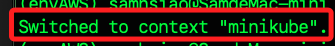

# 部署 

_在 MacOS 上部署應用到 Minikube_

<br>

## 步驟

1. 設置環境變量 KUBECONFIG，以指定 kubectl 使用特定的配置文件，因為這個設定尚無持久化，所以每次都必須設定。

   ```bash
   export KUBECONFIG=~/.kube/config
   ```

<br>

2. 切換到 Minikube 上下文 `minikube`。

   ```bash
   kubectl config use-context minikube
   ```

   

<br>

3. 將腳本保存到一個文件（例如 `deployment.yaml`），然後部署應用。

   ```bash
   kubectl apply -f deployment.yaml
   ```

<br>

4. 確認部署。

   ```bash
   kubectl get deployments
   kubectl get services
   ```

<br>

## 在 MacOS 上部署應用到 K3s

1. 設置環境變數。

   ```bash
   export KUBECONFIG=~/.kube/config_k3s
   ```

<br>

2. 部署應用，可使用同樣的腳本文件。

   ```bash
   kubectl apply -f deployment.yaml
   ```

<br>

3. 確認部署。

   ```bash
   kubectl get deployments
   kubectl get services
   ```

<br>

___

_END_
