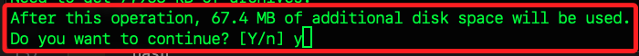
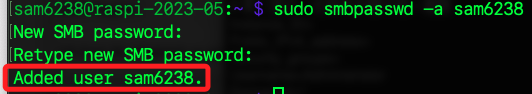
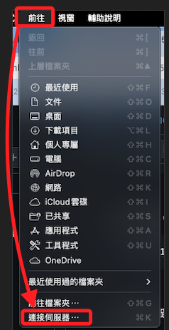
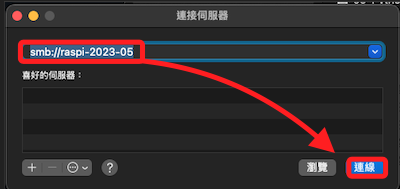
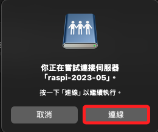
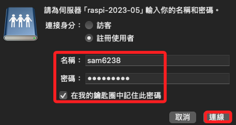
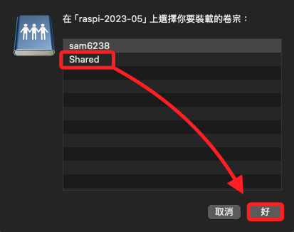

# 在樹莓派架設小型的 NAS

<br>

## 步驟

1. 更新所有系統軟體。

    ```bash
    sudo apt update && sudo apt upgrade -y
    ```

<br>

2. 安裝 Samba，會詢問是否繼續，使用參數 `-y` 直接預設為 `yes`。

    ```bash
    sudo apt install samba samba-common-bin -y
    ```

    

<br>

3. 創建一個文件夾存放共享的資料；特別注意，`~/` 就是 `/home/<使用者帳號>` 的個人目錄。

    ```bash
    mkdir ~/shared && chmod 777 ~/shared
    ```

<br>

4. 編輯 Samba 設定檔並新增共享文件夾的設定。

    ```bash
    sudo nano /etc/samba/smb.conf
    ```

<br>

5. 在文件的末尾添加以下內容，允許用戶在共享資料夾 `shared` 中進行讀寫；其中 `path` 要填寫絕對路徑，使用相對路徑 `~/` 會出錯。

    ```bash
    [Shared]
    path = /home/<使用者帳號>/shared
    writeable=Yes
    create mask=0777
    directory mask=0777
    public=no

    [global]
    min protocol = SMB2
    max protocol = SMB3
    ```

<br>

6. 為 Samba 設置一個用戶名和密碼；這裡使用 `sam6238` 作為範例，也就是我的個人帳號，過程中需要輸入兩次密碼。

    ```bash
    sudo smbpasswd -a sam6238
    ```

    

<br>

7. 重啟 Samba 服務以使配置生效。

    ```bash
    sudo systemctl restart smbd
    ```

<br>

## 設定外接硬碟

_如果要使用 USB 硬碟作為主要存儲設備_

<br>

1. 插入 USB 硬碟後，先查看系統是否能偵測到。

    ```bash
    lsblk
    ```

<br>

2. 為了自動掛載硬碟，首先編輯 `fstab` 文件。

    ```bash
    sudo nano /etc/fstab
    ```

<br>

3. 添加掛載點，這部分根據自己的硬碟設備和文件系統類型調整。

    ```bash
    /dev/sda1 /mnt/nas ext4 defaults 0 0
    ```

<br>

4. 手動掛載硬碟。

    ```bash
    sudo mount -a
    ```

<br>

## 從其他設備訪問 NAS

1. 在 Windows 上，打開 `檔案總管` 並在地址欄中輸入 `\\<Raspberry Pi 的 IP>\Shared`，然後按下 `Enter`；系統會要求輸入用戶名和密碼。

<br>

2. 在 macOS 上，進入 Finder 後選擇 `連接到伺服器`。

    

<br>

3. 輸入 `smb://<Raspberry Pi 的 IP>`；其中 IP 也可以使用 Hostname，若要指定連線到某個資料夾如 `/shared`，可直接加在位址之後。

    

<br>

4. 點擊連線。

    

<br>

5. 修改名稱並輸入密碼。



6. 選擇要連線的磁區，然後點擊 `好`。




## 設定開機自動掛載硬碟

_如果將外接硬碟用作存儲空間，要確保在每次開機時能自動掛載；_

<br>

1. 使用以下命令來查看系統中所有磁碟的 UUID。

    ```bash
    lsblk -f
    ```

<br>

2. 將看到類似於以下的輸出，其中 `sda1` 是外接硬碟分區，對應的 `UUID` 會顯示在其旁邊。

    ```bash
    NAME        FSTYPE LABEL UUID                                 MOUNTPOINT
    sda         ext4         xxxxxxxx-xxxx-xxxx-xxxx-xxxxxxxxxxxx 
    └─sda1      ext4         xxxxxxxx-xxxx-xxxx-xxxx-xxxxxxxxxxxx /mnt/nas
    ```

<br>

3. 取得硬碟的 UUID 後，編輯 `/etc/fstab` 文件。

    ```bash
    sudo nano /etc/fstab
    ```

<br>

4. 在文件末尾添加自動掛載配置，使用剛剛查到的 UUID 替換 `UUID=XXXXXXXX`；保存 `Ctrl+O` 並退出 `Ctrl+X`。

    ```bash
    UUID=xxxxxxxx-xxxx-xxxx-xxxx-xxxxxxxxxxxx /mnt/nas ext4 defaults,auto,users,rw,nofail 0 0
    ```

<br>

5. 測試是否可以正確掛載；這將掛載 `fstab` 中定義的所有分區，如果沒有錯誤信息，表示掛載成功。

    ```bash
    sudo mount -a
    ```

<br>

6. 確認硬碟是否已經成功掛載到 `/mnt/nas`，在輸出中會看到 `/mnt/nas` 的掛載信息。

    ```bash
    df -h
    ```

<br>

___

_END_