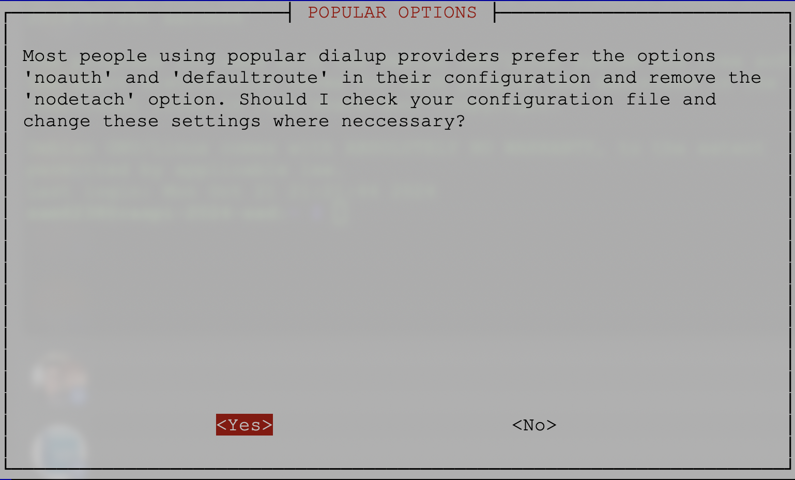

# PPPoE

_以下以中華電信為例_

<br>

## 說明

1. 如果樹莓派沒有透過路由器，而是直接連接中華電信的數據機，需要在樹莓派上設定 `PPPoE` 來使用固定 IP，樹莓派在這樣的設置下會直接通過數據機進行撥接上網。

<br>

## 步驟

1. 在樹莓派安裝 PPPoE 客戶端工具 `pppoeconf`。

    ```bash
    sudo apt update
    sudo apt install pppoeconf
    ```

<br>

2. 啟動並配置 PPPoE；這個工具會自動掃描網路介面，並嘗試檢測是否有 PPPoE 伺服器可用。

    ```bash
    sudo pppoeconf
    ```

<br>

3. 選擇 `Yes`，讓系統自動調整配置，這些設定讓 PPPoE 連線運行得更加順暢。

    

<br>

4. 需要輸入 PPPoE 登錄的用戶名，前綴就是 HN 後的那一串數字，符號 `@` 後的尾綴必須先加上 `ip`，整體表達如下。

    ```bash
    xxxxxxxx@ip.hinet.net
    ```

    

<br>

5. 選擇 `YES`；系統詢問是否要將中華電信提供的 `DNS` 伺服器自動添加到 `/etc/resolv.conf` 文件中，以便用於域名解析。

    

<br>

6. `pppoeconf` 工具建議將 `MSS（最大段長度）` 限制為 `1452` 字節，這是一個常見的設置，特別是在使用 PPPoE 連線時，由於 PPPoE 封包的開銷會減少可用的 `MTU（最大傳輸單元）`，`MSS` 通常需要調整以確保穩定的網路連接；選擇 `YES` 即可。

    

<br>

7. 系統詢問是否要在開機時自動啟動 PPPoE 連線，選擇 `Yes`。

    

<br>

8. 系統詢問是否現在立即啟動 PPPoE 連線，選擇 `Yes`。

    

<br>

9. 連線已經啟動成功。

    

<br>

## 啟動 PPPoE 連線

1. 配置完成後，`pppoeconf` 會自動啟動 PPPoE 連線；如果它沒有自動啟動，可手動啟動 PPPoE。

    ```bash
    sudo pon dsl-provider
    ```

<br>

2. 檢查 PPPoE 連線狀態；這會顯示 `ppp0` 接口，並且顯示公共 IP 地址，這就是固定 IP 地址。

    ```bash
    ifconfig ppp0
    ```

<br>

## 查詢

1. 使用 plog 來檢查 PPPoE 連線的狀態，並查看相關日誌。

    ```bash
    plog
    ```

<br>

2. 檢查 PPPoE 網路介面的詳細資訊，確認 PPPoE 連線是否成功並檢查分配的 IP 地址。

    ```bash
    ip addr show ppp0
    ```

<br>

## 設置開機自動連線

1. 為了確保樹莓派在每次開機時自動連線到網際網路，可將 PPPoE 設定添加到啟動腳本中，當樹莓派啟動時，會自動撥號連線；編輯 `/etc/rc.local` 文件。


    ```bash
    sudo nano /etc/rc.local
    ```

<br>

2. 在 `exit 0` 之前添加以下代碼，保存並退出。

    ```bash
    sudo pon dsl-provider
    ```

<br>

##  測試外網連接

1. 配置完成後，可嘗試從外網使用固定 IP 連接樹莓派，如果有開啟設置 SSH 服務，可使用以下指令連接。

    ```bash
    ssh <樹莓派使用者帳號>@<固定 IP>
    ```

<br>

## 安全配置

_由於將 SSH 暴露在外網上_

<br>

1. 使用 SSH 公鑰驗證 來替代密碼。

<br>

2. 可修改 SSH 默認端口 避免常見的暴力攻擊。

<br>

3. 設定防火牆 來限制只有特定 IP 能訪問樹莓派。

<br>

___

_END_