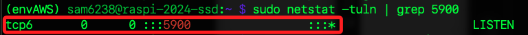
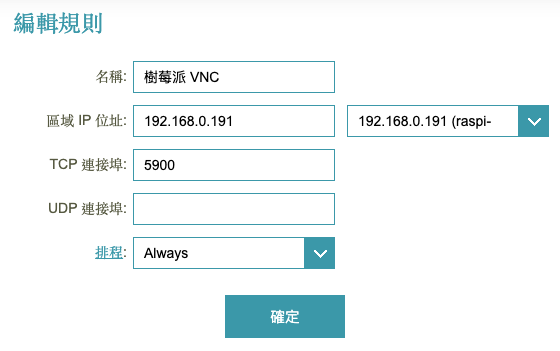
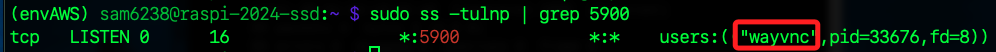

# 路由器設置

_以下設置使用的是中華電信的網路，搭配 DLink AC3200 路由器。_

<br>

## VNC

1. 在樹莓派查詢端口，其中 5900 正在被監聽。

    ```bash
    sudo netstat -tuln | grep 5900
    ```

    

<br>

2. AC3200 的端口設置是 `一對一`，所以要使用 `5900` 轉發；注意，UDP 必須留空。

    

<br>

## 連線

1. 連線時在 IP 後指定端口 `5900`。

    ```bash
    114.34.xxx.xxx:5900
    ```

    

<br>

## 其他

1. 檢查服務名稱。

    ```bash
    sudo ss -tulnp | grep 5900
    ```

    

<br>

2. 或使用。

    ```bash
    sudo netstat -plnt | grep 5900
    ```

<br>

___

_END_