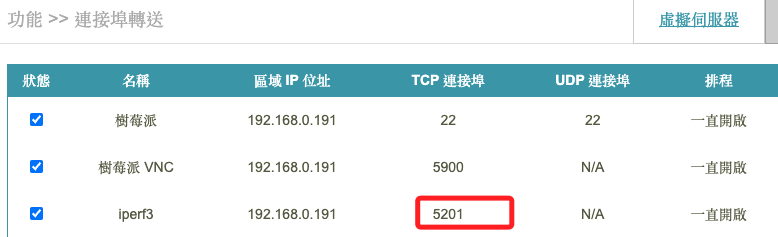
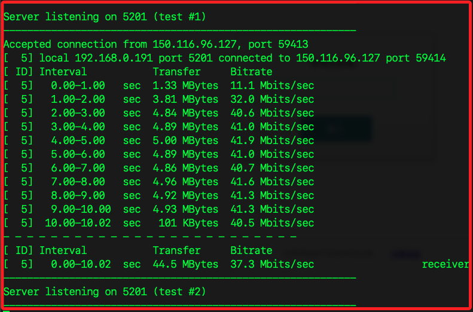
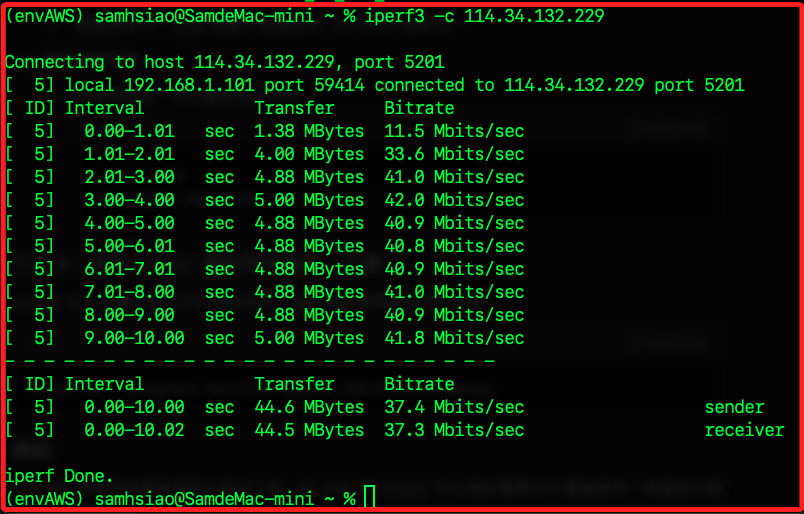
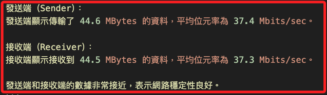

# 測試傳輸速率

_使用 `iperf3` 測試本地電腦和遠端樹莓派間的傳輸速率，這需要在兩端設備都安裝 `iperf3`。_

<br>

## 準備工作

1. 假如使用路由器，需開啟端口轉接 `5201`。

    

<br>

## 步驟

1. 在樹莓派上安裝 `iperf3`。

    ```bash
    sudo apt update
    sudo apt install iperf3
    ```

<br>

2. 在 macOS 通過 Homebrew 安裝 `iperf3`。

    ```bash
    brew install iperf3
    ```

<br>

3. 在樹莓派上啟動 `iperf3` 伺服器。

    ```bash
    iperf3 -s
    ```

<br>

4. 在本地電腦執行 `iperf3` 客戶端進行連線，同時測試網路頻寬。

    ```bash
    iperf3 -c 192.168.0.191
    ```

<br>

## 可選參數

1.  `-t`：設置測試時間（預設 10 秒）。

    ```bash
    iperf3 -c 192.168.0.191 -t 20
    ```

<br>

2. `-u`：使用 UDP 而非 TCP 進行測試，適用於測試不穩定的網路環境。

    ```bash
    iperf3 -c 192.168.0.191 -u
    ```

<br>

## 結果

1. 遠端設備。

    

<br>

2. 本地設備。

    

<br>

3. 解析。

    

<br>

___

_END_