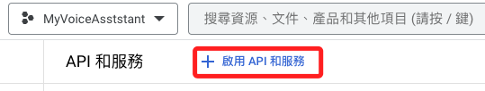
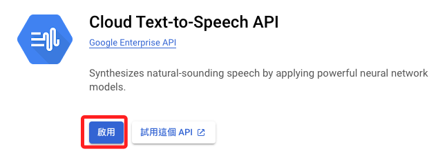
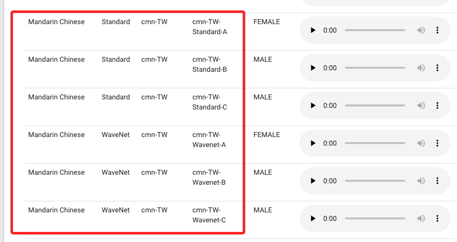

# Cloud Text-to-Speech API

<br>

## 開啟 Google Cloud

1. 搜尋 API `Text-to-Speech`

    ```bash
    Clous Text-to-Speech API
    ```

    

<br>

2. 添加

    

<br>

3. 在 [官網](https://cloud.google.com/text-to-speech/docs/voices) 可查詢語音助理的類型，之後要在程式碼中設定。

    


<br>


---

_END_