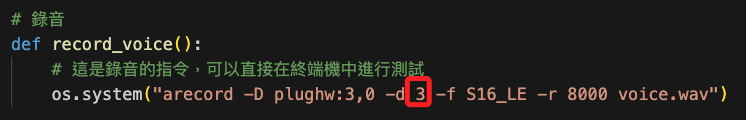
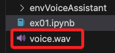
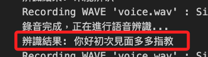

# 語音轉文字+語音

_使用 speech_v1p1beta1_

<br>

## 說明

1. 使用 `google.cloud.speech_v1p1beta1 as speech`，Google Cloud Speech-to-Text 客戶端庫的 v1p1beta1 版本。
2. 這個範例改用 `arecord` 作為錄音工具，採樣率改用8000Hz，格式改用 MP3，與前一個範例相較只是示範不同的錄製指令，並無實質差異。

<br>

## 範例

1. GC 所需套件，這在第六小節已安裝過的話，此處免再安裝。

   ```bash
   pip install google-cloud-texttospeech
   ```

<br>

2. 執行程式之前，務必確認錄音設備所在的卡片編號。 

    ```bash
    arecord -l
    ```

<br>

3. 程式碼


   ```python
   import os
   from google.cloud import speech_v1p1beta1 as speech
   from google.cloud import texttospeech

   # 初始化語音客戶端
   client = speech.SpeechClient()
   # 初始化 Google Text-to-Speech client
   tts_client = texttospeech.TextToSpeechClient()

   # 錄音
   def record_voice():
       # 這是錄音的指令，可以直接在終端機中進行測試
       os.system("arecord -D plughw:3,0 -d 3 -f S16_LE -r 8000 voice.wav")

   # Voice-to-text function
   def transcribe_voice():
       # 打開錄製的音頻
       with open("voice.wav", "rb") as audio_file:
           # 讀出內容給 content
           content = audio_file.read()

       # 將 content 進行辨識
       audio = speech.RecognitionAudio(content=content)
       config = speech.RecognitionConfig(
           encoding=speech.RecognitionConfig.AudioEncoding.LINEAR16,
           sample_rate_hertz=8000,
           language_code="cmn-Hant-TW",
       )

       response = client.recognize(config=config, audio=audio)
       if response.results:
           return response.results[0].alternatives[0].transcript
       else:
           return "無法辨識"

   # 轉中文語音輸出
   def text_to_speech(text):
       synthesis_input = texttospeech.SynthesisInput(text=text)

       # 建構語音請求，選擇語言和聲音
       voice = texttospeech.VoiceSelectionParams(
           language_code='cmn-Hant-TW',
           # 選擇一個支援中文的聲音
           # name='cmn-TW-Standard-A',   # 女
           name='cmn-TW-Wavenet-C',     # 男
           ssml_gender=texttospeech.SsmlVoiceGender.NEUTRAL)

       # 選擇音訊檔案類型
       audio_config = texttospeech.AudioConfig(
           audio_encoding=texttospeech.AudioEncoding.MP3)

       # 發送請求
       response = tts_client.synthesize_speech(
           input=synthesis_input, voice=voice, audio_config=audio_config)

       # 將產生的音訊儲存為 MP3 文件
       with open('output.mp3', 'wb') as out:
           out.write(response.audio_content)
           print('音頻內容寫入檔案 "output.mp3"')

       return 'output.mp3'

   # 主程序
   def main():
       try:
           # 初始提示，等待用戶按下 Enter 鍵
           input("請按下 Enter 鍵開始錄音，或者輸入 '退出' 來結束程序。") 
           while True:
               # 錄音
               record_voice()
               print("錄音完成，正在進行語音辨識...")
               # 轉錄語音
               text = transcribe_voice()
               print(f"辨識結果: {text}")

               # 語音輸出結果，這裡替使用 Google Text-to-Speech
               # 確保有轉錄內容
               if text.strip() != "":
                   # 使用 Google Text-to-Speech 進行語音輸出
                   audio_file = text_to_speech(text) 
                   # 使用 mpg123 播放 MP3
                   os.system(f"mpg123 {audio_file}")  

               # 等待用戶輸入 ENTER 在繼續，或輸入 `exit` 結束。
               user_input = input("按下 Enter 鍵以繼續，或輸入 'exit' 來結束程序。")
               if user_input.lower() == 'exit':
                   break
       except KeyboardInterrupt:
           # 用户按下 Ctrl+C
           print("程序已被用户中斷")
       except Exception as e:
           # 其他異常處理
           print(f"程序發生錯誤：{e}")

   if __name__ == "__main__":
       main()
   ```

<br>

3. 可透過修改秒數來改變錄音時間

   

<br>

4. 執行後會新增一個音檔

   

<br>

5. 會輸出辨識結果

   

<br>

---

_END_
