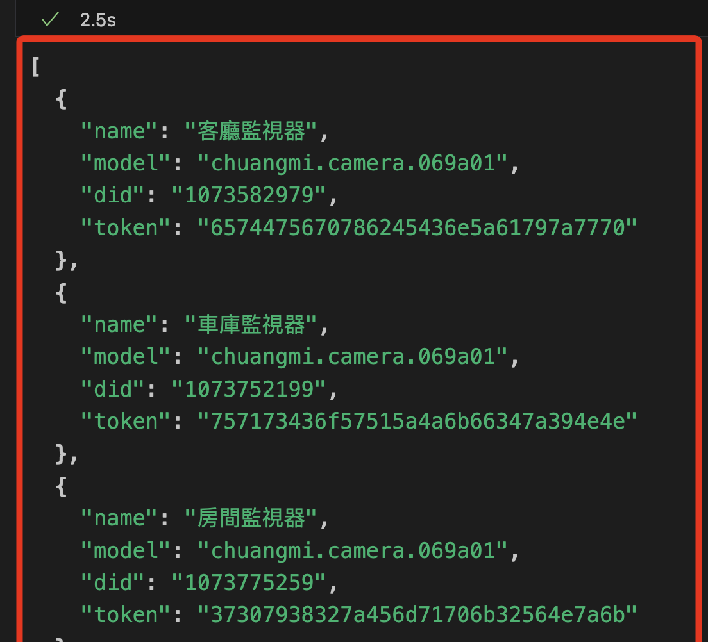
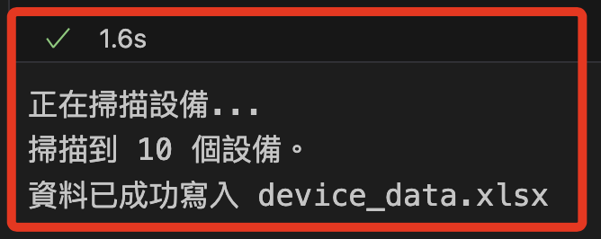
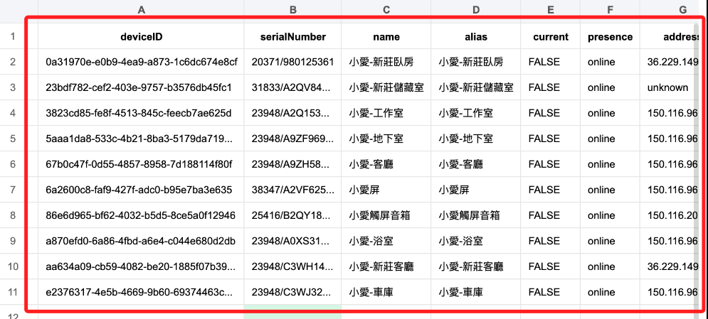
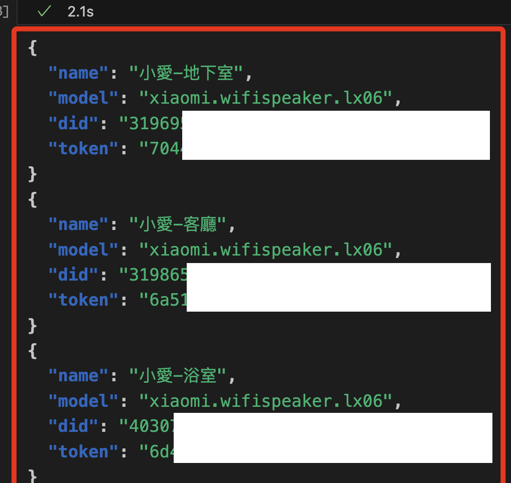

# 結合 OpenAI

_使用套件 `xiaogpt`，參考 [網路資源](https://github.com/yihong0618/xiaogpt)_

<br>

## 步驟

1. 安裝套件。

```bash
pip install -U --force-reinstall xiaogpt
pip install pandas openpyxl
pip install nest_asyncio

```

2. 建立環境變數。

    ```python
    # 米家帳號
    os.environ['MI_USER'] = '<填入自己的米家帳號>'
    os.environ['MI_PASS'] = '<填入自己的-OPENAI-APIKEY>'
    ```

<br>

2. 假如已知設備，可指定設備 DID，舉例說某台 `小愛音箱 pro`。

    ```python
    # 設備 DID
    os.environ['MI_DID'] = '319865370'
    ```

<br>

3. 若會串接 OpenAI，則需設定 API Key。

    ```python
    # OpenAI
    os.environ['OPENAI_API_KEY'] = '<填入自己的-OPENAI-APIKEY>'
    ```

<br>

## 篩選指定設備

1. 查詢設備清單。

```python
!micli.py list
```



2. 掃描設備並將資料寫入 Excel。

```python
import json
import pandas as pd
from openpyxl import Workbook
from miservice import MiAccount, MiNAService
import asyncio
from aiohttp import ClientSession
import os
# 解決嵌套事件循環問題
import nest_asyncio

# 解決嵌套事件循環問題
nest_asyncio.apply()

# 1. 掃描設備的函數
async def scan_devices():
    try:
        env_get = os.environ.get
        store = os.path.join(os.path.expanduser("~"), ".mi.token")
        async with ClientSession() as session:
            account = MiAccount(
                session, env_get("MI_USER"), env_get("MI_PASS"), store
            )
            service = MiNAService(account)
            devices = await service.device_list()
            return devices
    except Exception as e:
        print(f"設備掃描失敗: {e}")
        return []

# 2. 寫入 Excel 的函數
def write_to_excel(devices, output_file="device_data.xlsx"):
    if not devices:
        print("無法掃描到任何設備。")
        return

    # 預處理設備資料，處理缺失的 model 和 name 欄位
    processed_devices = []
    for device in devices:
        device["model"] = device.get("model", "Unknown Model")
        device["name"] = device.get("name", "Unknown Name")
        processed_devices.append(device)

    # 將設備資料轉換為 DataFrame
    df = pd.DataFrame(processed_devices)

    # 主資料表：包含完整設備資料
    with pd.ExcelWriter(output_file, engine="openpyxl") as writer:
        # 寫入主資料表
        df.to_excel(writer, index=False, sheet_name="Device Data")

        # 設備名稱與模型對照表
        model_name_mapping = df[["model", "name"]].drop_duplicates()
        model_name_mapping.to_excel(writer, index=False, sheet_name="Model Name Mapping")

    print(f"資料已成功寫入 {output_file}")

# 3. 主程序
async def main():
    print("正在掃描設備...")
    devices = await scan_devices()
    if devices:
        print(f"掃描到 {len(devices)} 個設備。")
        write_to_excel(devices)
    else:
        print("未掃描到任何設備，請檢查賬戶或網絡設置。")

if __name__ == "__main__":
    # 確保環境變數已設置
    if not os.getenv("MI_USER") or not os.getenv("MI_PASS"):
        print("請先設置環境變數 MI_USER 和 MI_PASS，然後重新運行腳本。")
    else:
        # 在 Jupyter Notebook 或其他事件循環環境中運行
        asyncio.run(main())
```



3. 顯示跨家庭的設備清單，但是僅有音箱。



4. 查詢指定設備類型的清單，這裡查詢的是 `小愛音箱 pro`，設備型號識別碼是 `xiaomi.wifispeaker.lx06`。

```python
!micli.py list | sed 's/\x1b\[[0-9;]*m//g' | jq '.[] | select(.model == "xiaomi.wifispeaker.lx06")'
```



## 