# PostgreSQL

_使用 Docker_

<br>

## 說明

1. 在 `倉庫伺服器` 搜索 `postgres`。

    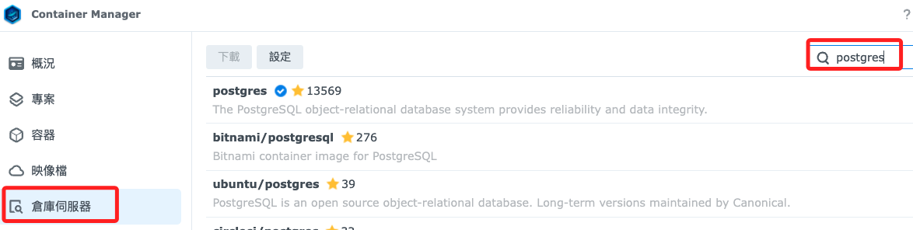

<br>

2. 選擇映像 `postgres`。

    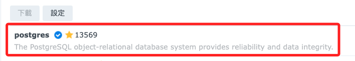

<br>

3. 點擊下載。

    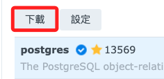

<br>

4. 選擇標籤 `lastest`，接著 `套用`。

    

<br>

5. 完成時會自動切換到 `映像檔` 頁籤。

    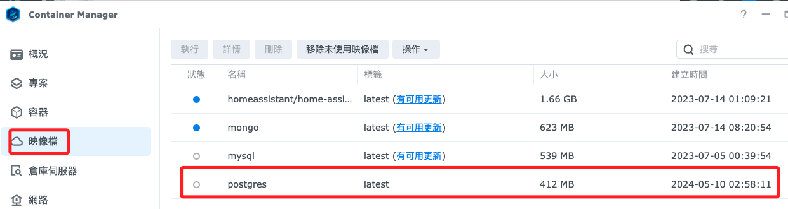

<br>

6. 選取之後 `執行`。

    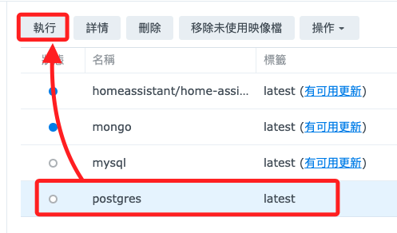

<br>

## 配置 PostgreSQL 容器

1. 使用預設的容器名稱 `postgres-1`，勾選 `啟用自動重啟`，點擊 `下一步`。

    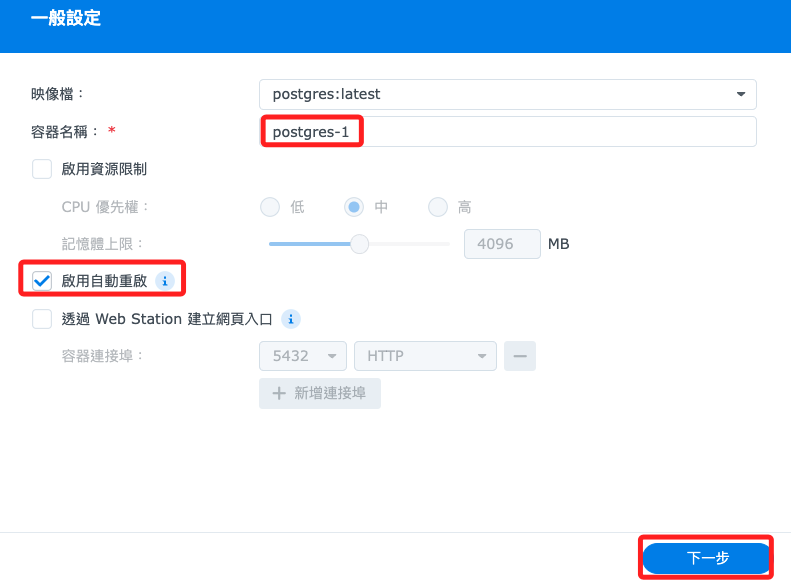

<br>

2. 進階設定部分，先添加環境變量來配置 PostgreSQL。

    ```bash
    POSTGRES_USER=sam6238
    POSTGRES_PASSWORD=<輸入自己的密碼>
    POSTGRES_DB=mydatabase
    ```

    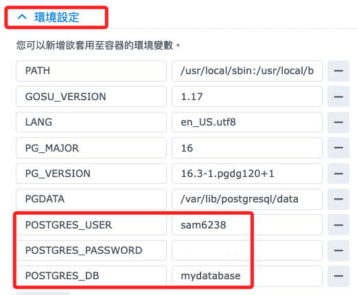

<br>

3. 由於本機 `5432` 已經使用，所以設定為 `5431` 來連接容器的 `5432`。

    

<br>

4. 在 `儲存空間` 部分，先新增一個資料夾，然後選取作為持久化數據的位置。

    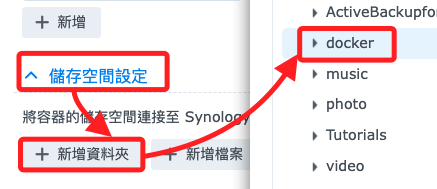

<br>

5. 先建立好再來選，或是建立之後選取皆可。

    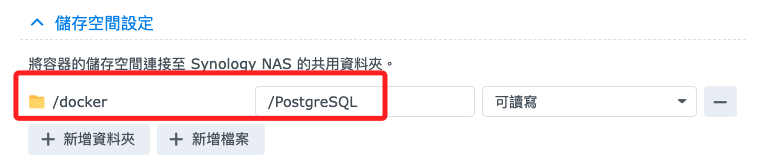

<br>

6. 完成配置後，啟動容器。

    

<br>

7. 切換到容器頁籤可看到亮綠燈。

    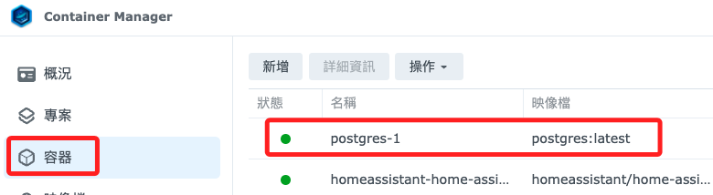

<br>

## 連線

1. 使用 pgAdmin 或 `psql` 客戶端連接到 PostgreSQL 以測試連接。例如：

    ```bash
    # 指令說明
    psql -h [NAS_IP] -p [映射的端口] -U sam6238 -d mydatabase

    # 實際指令
    psql -h 192.168.1.240 -p 5431 -U sam6238 -d mydatabase
    ```

<br>

2. 接著會提示輸入密碼，輸入的是 PostgreSQL 資料庫的密碼，不是 NAS 的密碼。

    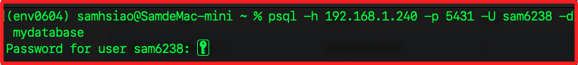

<br>

3. 完成時便會顯示所在資料庫了。

    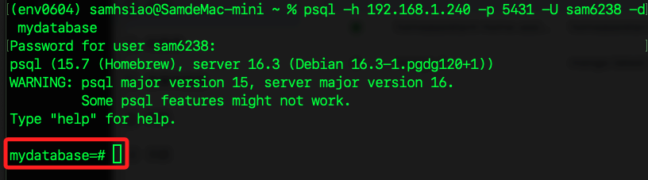

<br>

___

_END_