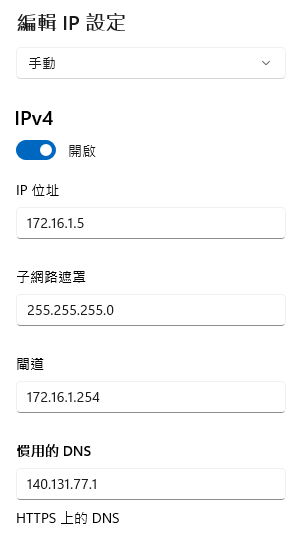

# 網路設定說明

## 教室電腦及樹梅派

- 如果使用教室內的電腦，電腦的網路是無需特殊設定的。
- 至於樹莓派，不需要查找 IP 地址，只需接上熱點或學校網路，再使用 `主機名稱` 進行連接即可。

## 若使用自己的電腦

- 基本上插上即可使用，如果需要設定特定 IP 的話，可參考以下設定值。

### 將 DNS 設置為 `8.8.8.8`。

### 或將 DNS 切換到 `140.131.77.1`。

---

END
