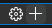
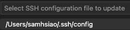

以下是優化過後的排版：

---

# 第一次啟動

## 📌 特別注意
1. **安裝時**：務必設定將 SSH 開啟並設置密碼。
2. **終端機**：先使用終端機設定並開啟 VNC。
3. **VSCode**：接著示範使用 VSCode 遠端連線。
4. **VNC**：最後再使用 VNC。

---

## 🖥️ 使用終端機

**第一次啟動建議先使用「終端機」進行連線**

1. 在終端機使用 SSH 連線指令進行連線
    ```bash
    ssh 使用者帳號＠主機名稱 或 IP
    ```
    若是第一次連線會被問到是否要繼續

    

2. 輸入密碼

    

3. 完成連線畫面

    

4. 退出終端機指令

    ```bash
    exit
    ```

5. 進行設定開啟 VNC，終端機指令

    ```bash
    sudo raspi-config
    ```
    

6. 以上下鍵選 `Interface`
   
   

7. 開啟 `VNC`
   
   

8. 以 `TAB` 鍵選取 'YES`

    

9. 按下 `FINISH` 完成

    


## 🛠️ VSCode 遠端連線

1. 透過 VSCode 的「遠端總管」進行連線

    

2. 添加連線

    

3. 使用 SSH 連線及主機名稱

    ```bash
    ssh 使用者名稱@主機名稱
    ```

4. 選擇保存 SSH 配置的位置

    

5. 點擊「Connect」進行連線

    

6. 輸入您的密碼

    

7. 連線完成時，右下角將顯示相關信息

    

---

## 🖼️ VNC 連線

**注意**：可能會出現「Cannot currently show the desktop」的錯誤。

1. [下載 VNC Viewer](https://www.realvnc.com/en/connect/download/viewer/)
   
    啟動 VNC Viewer

    

2. 輸入主機名稱或 IP

    
    

3. 輸入帳號、密碼並選擇記住密碼，然後點擊「OK」

    


**指令提示**

- 關機指令

    ```bash
    sudo shutdown now
    ```

- 重新啟動指令

    ```bash
    sudo reboot now
    ```

**注意**

- 可以多人同時透過 VNC 連線進入同一台樹莓派主機，且會看到多個滑鼠指標，但這些滑鼠指標會同步控制。

- 樹莓派 3 應該可以正常顯示，樹莓派 4 可能會出現「Cannot currently show the desktop」的錯誤。

---

END