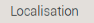
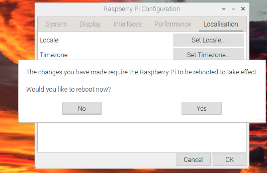

# 🛠 環境設置

  *完整介紹環境設置*

</br>

## 基本環境設置

</br>

1. 開啟樹莓派後，左上角點擊樹莓派圖標

   

2. 在「偏好設定」中選擇「Raspberry Pi 設定」

   

3. 於「系統」部分，除非開始時沒有設定主機名稱，否則不須做其他設定

      

4. 點選「Display」頁籤，其中「Headless Resolution」是在不接螢幕的情況下的解析度

   

5. 在「介面」頁籤中，建議將所有的服務全部開啟，尤其是 VNC 一定要確保已開啟

   

6. 進行地區設置（Locatcalisation、在地化）

   

7. 設定語系，且特別注意，字元集（Character Set）應設為「UTF-8」

   

8. 完成設置後，記得儲存並重啟系統

   

9. （等待）

   

10. 如果發現解析度仍然偏低，請進入「關於螢幕解析度」部分進行調整。詳細的調整方法將在下一部分進行說明.

---

</br>

## 🖥 關於螢幕解析度

### 1. 無頭模式 `Headless` 設定

   - 透過修改設定檔 `config.txt` 來設定螢幕解析度

</br>

### 1. 登入樹莓派後的解析度設定

   - 1. 登入樹莓派後，如果發現解析度很低，先檢查系統偏好裡的螢幕設定。
   
   - 2. 假如遇到無法選取沒關係，可以直接跳到 `步驟4` 編輯設定檔案。
      
      

   - 3. 或是發現解析度（Resolution）僅提供 `640*480` 這一選項

     

   - 4. 使用終端機開啟並修改設定檔案：

        ```bash
        sudo nano /boot/config.txt
        ```

</br>

### 2. 解析度設定：2K電腦螢幕與4K電視

   - 1. **2K電腦螢幕**:

        
   - 2. `hdmi_group` 有 `CEA` 或 `DMT` 兩種模式

        1. CEA: 用於電視機
        2. DMT: 用於電腦螢幕
   - 3. **4K電視**:

        
   - 4. 渲染解析度參數設定：

        ```
        framebuffer_width=1920
        framebuffer_height=1080
        ```

     - 這兩個數值 `framebuffer_width` 和 `framebuffer_height` 基本上需要與 `hdmi_group`、`hdmi_mode` 匹配。意思是將指定的解析度渲染到 hdmi 螢幕上。

</br>

### 3. 對照表與說明

- **DMT (電腦監視器，`hdmi_group=2` )**
  | MODE | 解析度    | 刷新率 |
  | ---- | --------- | ------ |
  | 4    | 640x480   | 60Hz   |
  | 9    | 800x600   | 60Hz   |
  | 16   | 1024x768  | 60Hz   |
  | 35   | 1280x1024 | 60Hz   |
  | 51   | 1600x1200 | 60Hz   |
  | 58   | 1680x1050 | 60Hz   |
  | 82   | 1920x1080 | 60Hz   |
- **CEA (電視，`hdmi_group=1` )**
  | Mode | 解析度    | 刷新率 |
  | ---- | --------- | ------ |
  | 1    | 640x480   | 60Hz   |
  | 4    | 1280x720  | 60Hz   |
  | 16   | 1920x1080 | 60Hz   |
  | 31   | 1920x1080 | 50Hz   |
  | 34   | 1920x1080 | 30Hz   |

### 4. 重新啟動後的設定

   - 1. 重啟後進入 `Screen Configuration`。
   - 2. 選擇想要的解析度，例如： `1920x1080`。
   - 3. 若有進行更改，完成後點擊 `Apply` 保存設定。

---

END
