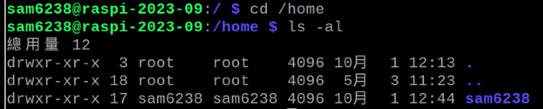
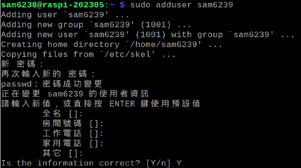
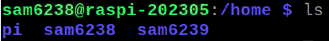
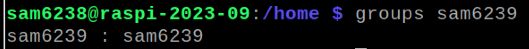
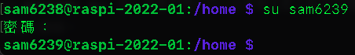
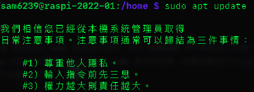
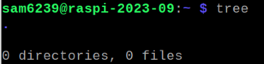

# 建立用戶

## 建立並加入 sudo

- 切換到家目錄
    ```
    cd /home
    ```

</br>

- 查詢當前用戶

    ```
    ls -al
    ```

    

</br>

- 建立（添加）用戶

    ```
    sudo adduser <自訂使用者名稱>
    ```

    


</br>

- 可在 Home 家目錄查看新添加的使用者
    ```
    cd /home && ls
    ```

    

</br>

- 查詢使用者所屬群組指令（建立好的時候沒權限）
    ```
    groups <使用者名稱>
    ```

    

</br>

- 切換使用者
    ```
    su <使用者名稱>
    ```

    

</br>

- 將使用者 sam6239 加入 root 群組
    ```
    sudo usermod -a -G sudo sam6239
    ```

    *指令參數說明*
    | 指令     | 說明                                       |
    |----------|--------------------------------------------|
    | `sudo`   | Super User Do                              |
    | `usermod`| 用來修改帳戶設定的命令，modify的意思         |
    | `-a`     | 將用戶添加到一個群組<br>與 -G 共用的時候就是加入 -G 後面的列表 |
    | `-G`     | 加入一個或多個組的列表                       |
    | `sam6239`| 這個指令要將目標帳號放在最後                 |


## 觀察與驗證

- 確認所在群組
    ```
    groups <使用者名稱>
    ```

</br>

- 切換帳號會出現提示
    ```
    su <使用者名稱>
    ```

    

</br>


- 查看新用戶的家目錄
    ```
    ls 
    ```

    

    *說明*
	1. 這是因為在 Linux 系統（如樹莓派）上創建一個新的帳戶時，系統會根據 `/etc/skel`目錄中的模板來創建新用戶的家目錄。
	2. `/etc/skel` 目錄通常包含了一些基礎的配置文件和目錄結構。
	3. 若要在建立用戶的時候，給每一個新用戶固定的初始好環境，可以編輯該檔案


---

END