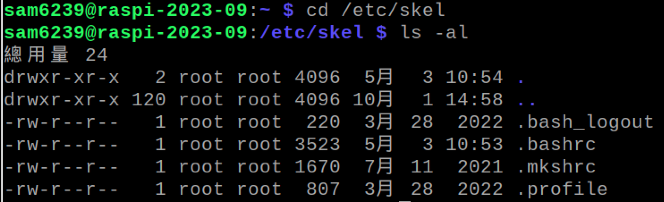
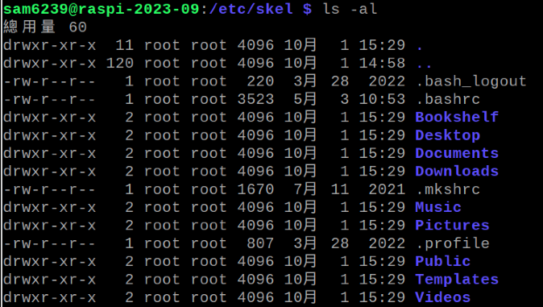
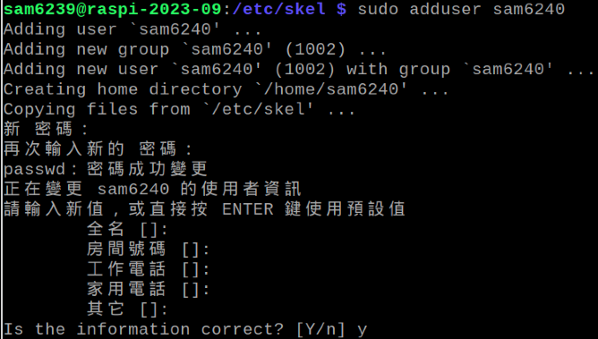
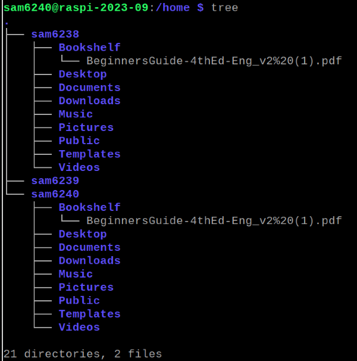

# 新用戶預設環境
- 建立新用戶時自動生成的基本環境

## 編輯預設還定檔案

1. 切換到設定檔案所在目錄
  
  ```bash
  cd /etc/skel
  ```

</br>

2. 查詢
  -確實有這些隱藏的設定檔案

  ```bash
  ls -al
  ```

  

</br>

- 透過 root 帳號（這裡是 sam6238）將 root 目錄下的檔案複製

  ```bash
  sudo cp -r /home/sam6238/* /etc/skel/
  ```

  

</br>

- 建立新用戶試試看

  ```bash
  sudo adduser <新用戶名稱>
  ```

  

</br>

- 進入新用戶的家目錄查看

  ```bash
  cd /home && tree
  ```

  

</br>

    *特別注意*
    *這些資料夾都是空的，這個操作只是示範如何透過樣板來建立相同狀態的使用者*

---

END
