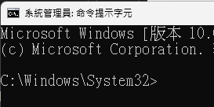
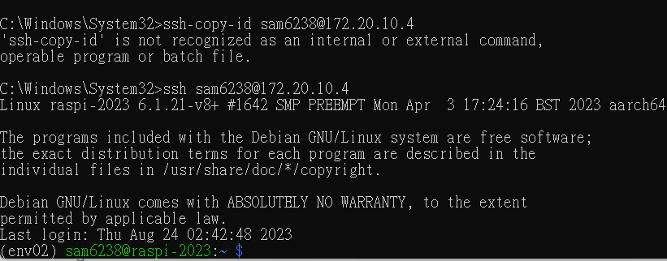

# 連線免密碼

*`Windows` 或 `Mac` 相同*

- 進入終端機

  

</br>

- 輸入指令建立公私鑰
    ```bash
    ssh-keygen
    ```

</br>

- 一直都按下 `ENTER` 以預設值建立即可

  

</br>

- 完成後，開啟本地資料夾 `查看預設的公鑰`

  - Windows 
    ```bash
    type c:\Users\<Win的使用者名稱>\.ssh\id_rsa.pub
    ```
    如
    ```bash
    type c:\Users\SamAcer\.ssh\id_rsa.pub
    ```
  - MacOS
    ```bash
    cat /Users/<Mac使用者名稱>/.ssh/id_rsa.pub
    ```
    如
    ```bash
    cat ~/.ssh/id_rsa.pub
    ```

</br>

- 稍後步驟會需要複製貼上公鑰內容

  

</br>

- 連線樹梅派，在根目錄建立一個資料夾

  ```bash
  mkdir -p ~/.ssh
  ```

  *補充說明*

  - 參數 `-p` 用於建立多層級的資料夾時，不會因為父目錄已經存在而使得建立報錯。

</br>

- 在資料夾內建立一個檔案，貼上公鑰內容後，儲存 `control + o` ＆ 關閉檔案 `control + x`。

  ```bash
  sudo nano ~/.ssh/authorized_keys
  ```
  或使用完整路徑
  ```bash
  sudo nano /home/sam6238/.ssh/authorized_keys
  ```

</br>

- 可先透過 cat 查看，確認已經貼上
  ```bash
  cat ~/.ssh/authorized_keys
  ```

</br>

- 假如有多台設備都要連入，則一行寫一個公鑰

  

---

</br>

## 以下修改設定檔案
*非絕對必要，有時候沒設定也可以正常運行*


- 編輯 SSH 的設定檔
    ```bash
    sudo nano /etc/ssh/sshd_config
    ```

</br>

- 取消以下三行的註解

    ```
    PubkeyAuthentication yes
    ```
    ```
    AuthorizedKeysFile .ssh/authorized_keys
    ```
    ```
    PasswordAuthentication yes
    ```

</br>

- 關於編輯檔案所需的權限

    *修改 `~/.ssh` 目錄及其所有子目錄和檔案的權限，`700` 表示僅有 `擁有者` 具有 `讀、寫、執行` 的權限，而其他用戶沒有任何權限。*
    ```bash
    sudo chmod -R 700 ~/.ssh
    ```

    *更改 `~/.ssh/authorized_keys` 檔案的擁有者和所屬的組，與上一個指令呼應。*
    ```bash
    sudo chown <帳戶>:<群組> ~/.ssh/authorized_keys
    ```
    如
    ```bash
    sudo chown sam6238:sam6238 ~/.ssh/authorized_keys
    ```

</br>

- 重新啟動 SSH 服務
    ```bash
    sudo service ssh restart
    ```

</br>

- 退出連線
    ```bash
    exit
    ```

</br>

- *再次連線，不再提示輸入密碼， VSCODE 的 SSH 也一樣*

    

</br>

- 若要查看 SSH 日誌
    ```bash
    sudo journalctl -u ssh
    ```

</br>

- 使用 `-v` 參數進行連線查看更多連線資訊
    ```bash
    ssh -v <帳號>@<主機名稱>
    ```
    如
    ```bash
    ssh -v sam6238@raspi-2023-09
    ```

---

END