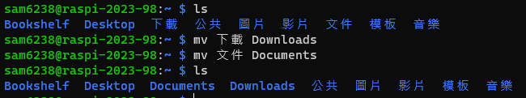
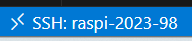

# 樹莓派安裝 VSCode

- 安裝的主要目的是要透過 VSCode 的SSH 可以連線虛擬機中的樹梅派
- 因為安裝 VSCode 才有 code-server

</br>

## 安裝前準備
- 因為先前是使用中文，所以目錄也會是中文
  
  

</br>

- 將其中的「下載」「文件」更名

    ```bash
    mv 下載 Downloads && mv 文件 Documents
    ```
    
    


</br>

## 開始安裝
*與樹莓派實機安裝 VSCode 程序相同*


- 進入下載 
    ```bash
    cd Downloads
    ```

</br>

- 下載
    ```bash
    curl -sSL https://packages.microsoft.com/keys/microsoft.asc | sudo apt-key add -
    ```

</br>

- 出現警告，可以改用以下指令，原本的指令還是可以運行
    ```bash
    curl -sSL https://packages.microsoft.com/keys/microsoft.asc -o microsoft.asc
    ```

</br>

- 將 VScode 添加到來源列表
    ```bash
    echo "deb [arch=amd64,arm64,armhf] https://packages.microsoft.com/repos/vscode stable main" | sudo tee /etc/apt/sources.list.d/vscode.list
    ```

</br>

- 更新＆安裝
    ```bash
    sudo apt update && sudo apt install code -y
    ```

</br>

- 完成安裝可看到應用
  
  


</br>

- 再次連線，成功

  

---

END