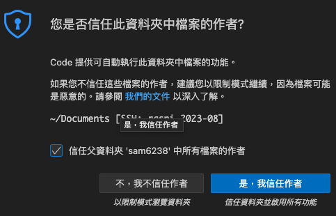

# 使用 VScode 中的「遠端總管」

## 步驟

1. 開啟 `遠端總管`：啟動 VScode 並連線到樹莓派。
   
   

 

2. 建立連線：根據提示或按照指引進行連線設置。
   
   

 

3. 選取連線的設定檔案：如果您之前有儲存設定，可以在此選擇。
   
   

 

4. 右下角連線：按下連線按鈕，開始連線程序。
   
   

 

5. 顯示：VScode 應該會顯示一個密碼輸入視窗。
   
   

 

6. 上方輸入密碼：輸入您的樹莓派使用者密碼。
   
   
   
 

7. 開啟檔案總管：在VScode中，您現在可以看到樹莓派的檔案系統。
   
   

 

8. 開啟資料夾：點擊 "Open Folder" 或其他類似選項。
   
   

 

9. 選取「~/Documents」：這將會開啟您在樹莓派上的 Documents 資料夾。
    
    

 

10. 第一次信任：如果是首次連線，VScode 可能會要求您信任此來源。
    
    

 

*完成連線到 `~/Documents`*

---

END
