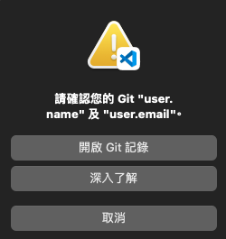

# 發佈至 GitHub

</br>

## 在樹莓派建立 Git 並且發佈到 GitHub 上

**注意**：

- 預設會將所在目錄（這裡是「Documents」）作為倉庫（Repository）名稱並在目錄下建立 Git，這對於日後專案管理可能會帶來困擾。
- 建議: 將資料放入指定的資料夾。

</br>

### 建立專案資料夾

1. 連線後先進入 `Documents` 目錄

   
2. 使用終端機或直接使用圖標建立資料夾

   ```bash
   mkdir <資料夾名稱>
   ```
3. 進入該資料夾並在 VScode 中開啟新的視窗，這樣可以確保在正確的路徑下建立倉庫。

   ```bash
   code .
   ```
4. 先建立一個 `README.md` 檔案，內容隨意輸入。
   
   

   _以上完成本地資料準備_

</br>


### 先登入 GitHub 帳號密碼

5. 進入 VSCode 之後先啟動一個終端機
   

6. 以 Git 指令設定用戶名稱和郵箱

   ```bash
   git config --global user.name samhsiao6238
   git config --global user.email samhsiao6238@gmail.com
   ```

   **注意**：
   _如果用戶名是由多個單詞組成的，例如「John Doe」，則必須使用引號包裹。_


</br>

### 建立遠端連線


7. 點擊 VScode 的 `原始檔控制` 。
   
   
   
8. 點擊 `發布至 GitHub` ，選擇公開或私有皆可。
   
   


9. 可以使用預設名稱或自訂名稱。

   
   
   

10. 選擇 `README.md` 檔案後，點擊 OK。
   
   
  

11. 給該提交一個版本命名後 `提交` 。

   

12. 需要輸入 GitHub 的帳號密碼。
   
   

</br>

13. 再次提交，點擊 `發佈到分支`（若需要，可不輸入訊息）。
    
   

14. 同前述，自定義一個倉庫名稱，或使用預設。
    
    

15. 完成後，可在 GitHub 上開啟並查看新建立的 Repo 以及 README.md。


**結束：成功在 GitHub 上建立新的 Repo。**

</br>

---

END
