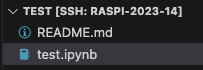

# 複製存放庫 📌

</br>

**重要提示**：請確保在正確的資料夾下開啟 VSCode。

</br>

## 克隆前準備

1. 連線後如果 `已經選取資料夾` 或 `尚未登入 GitHub` 會顯示 `初始化` 或 `發佈`

    


2. 需要設定用戶名稱和電子郵件地址以進行克隆操作：

    ```bash
    git config --global user.name samhsiao6238
    git config --global user.email samhsiao6238@gmail.com
    ```


3. 設定完關閉遠端連線然後重新登入，本來就設定好就直接關閉重新連線

    


4. 再次登入後，先不要選取資料夾，就可以看到正確的畫面。

    

</br>

## 開始複製

1. 選擇 `複製存放庫` 。
   
    


   
2. 從 GitHub 複製
   
   


3. 選擇要複製的存放庫。
   
   

4. 選擇要將存放庫克隆到的本地目錄，建議放在 `Documents` 目錄下。
   
   

5. 一旦完成，右下角應該會顯示相關的訊息，可選擇 `在新視窗中開啟` 。
   
    


</br>

## 本地建立檔案


1. 接著，可以嘗試手動建立一個 `.ipynb` 檔案。
   
   
   

2. VSCode 會提示安裝必要的組件。
   
   

3. 安裝完畢再次選擇 `.ipynb` 檔案的核心，依舊還不足以運行。
   
   

4. 手動到市集安裝
    
    

5. 接下來輸入 `jupyter` 並選取插件安裝。
    
    

6. 完成後點擊 `核心` 可選取 `Python 環境` 。
    
    

*此節說明先到此結束，目前已可以運行 .ipynb，接下來可以測試上傳，將在後面小節說明。*

</br>

---

**END：成功複製存放庫到本地目錄。**


