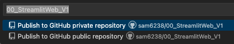

# Streamlit 網站託管
- 可將網站架設在官網
  
</br>

# 註冊

1. [官網](https://streamlit.io/)


2. 授權

    

3. 已經建立的 Streamlit 應用清單

    


4. 可以添加新的 app，這裡先不用，之後再回來添加

    

</br>

## 建立網站資料

1. 建立網站資料夾
   
   ```bash
   mkdir __streamlit_web_01__
   ```
   
   

2. 建立 README.md
   
   ```bash
   touch README.md
   ```
   

</br>

## 將資料夾發佈到 GitHub

1. 原始碼控制
   
   

2. 發佈至 GitHub
   
   

3. 選取
   
   

4. 勾選
   
   

</br>

## 建立網站內容

1. 建立必要檔案
   - app.py
   - requirements.txt
   
   ```bash
   touch app.py requirements.txt
   ```

2. 編輯腳本
   
   ```python
   import streamlit as st
    import matplotlib.pyplot as plt
    import numpy as np
    st.title('Streamlit 與 Matplotlib')
    fig, ax = plt.subplots()
    x = np.linspace(0, 20, 100)
    ax.plot(x, np.sin(x))
    st.pyplot(fig)
    st.write('這是一個使用 Matplotlib 在 Streamlit 上繪製的線圖。')
   ```

3. 編輯依賴文件
   
   ```bash
   streamlit
    matplotlib
    numpy
   ```

</br>

## 設定 Streamlit
- 回到官網

1. 添加
   
   

2. 選取倉庫
   
   

3. 前一個步驟也可以手動貼上超連結
   
   

4. 選擇儲存網站內容的倉庫
   
   

5. 設定網站主檔案路徑
   
   
   
6. 可自訂網址前綴
   
   

</br>

## 進階設定與部署

1. 可選取 Advanced settings 進行其他設定
   - 之後再補充
   
   

2. 完成後進行部署
   
   

3. 瀏覽器會顯示烘烤的示意圖
   
   

4. 完成後即可以指派的網址進行訪問
   
   

</br>

---
_END：以上完成在官網上佈置站台_