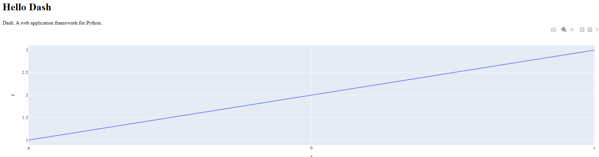

# Dash by Plotly
- 使用端口 8050

</br>

## 安裝
1. 基礎套件

    ```bash
    pip install dash plotly
    ```

2. 為了讓 Dash 可以更方便使用 Jupyter

    ```bash
    pip install jupyter-dash
    ```

3. 若要透過 `gunicorn` 啟動

    ```bash
    pip install gunicorn
    ```


</br>

## 範例
- 依個人偏好命名，這裡假設腳本命名為 `ex01_basic` 。

    ```python
    import dash
    from dash import dcc, html
    import plotly.express as px
    app = dash.Dash(__name__)
    # 提取出WSGI伺服器給gunicorn使用
    server = app.server  # 這是新增的行
    # 使用Plotly創建一個簡單的折線圖
    fig = px.line(x=["a", "b", "c"], y=[1, 2, 3])
    app.layout = html.Div(children=[
        html.H1(children='Hello Dash'),
        html.Div(children='Dash: A web application framework for Python.'),
        dcc.Graph(
            id='example-graph',
            figure=fig
        )
    ])
    if __name__ == '__main__':
        #
        app.run_server(debug=True, host='0.0.0.0')

    ```

</br>

## 啟動站台

1. 直接啟動：
   ```bash
   python ex01_basic.py
   ```
   

2. 透過 `gunicorn` 啟動

   ```bash
    gunicorn ex01_basic:server -b 0.0.0.0:8050
   ```

3. 瀏覽網頁
   
   
   
</br>

## 若要開啟防火牆轉接
- 透過 gunicorn 部署為網站

1. 安裝 ufw
```bash
sudo apt install ufw
```


2. 開啟8050轉接埠
```bash
sudo ufw allow 8050/tcp
```


3. 啟用ufw
```bash
sudo ufw enable
```


4. 查詢狀態
```bash
sudo ufw status
```


5. 瀏覽器查看網頁應用
```bash
http://172.20.10.4:8050/
```

</br>


## 從進程關閉 gunicorn

1. 查看PID

    ```bash
    ps aux | grep gunicorn
    ```


2. 或是使用 lsof 直接查看 8050 端口運行中的 PID

    ```bash
    lsof -i :8050
    ```
3. 停用(舉例說查到的PID=56812、57080)

    ```bash
    kill 56812 57080
    ```

</br>

---

_END：以上完成基本站台部署_