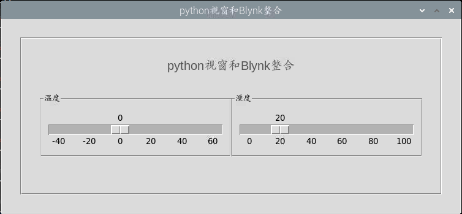
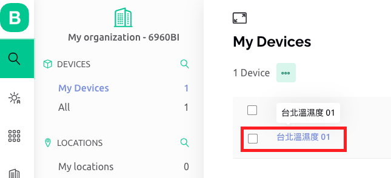

# 範例實作

- [官網說明](https://docs.blynk.io/en/blynk.cloud/https-api-overview)

</br>

## 步驟

1. 依據前一個步驟所取得 Token 先記錄下來

   ```bash
    #define BLYNK_TEMPLATE_ID "XXXXXXXXXX" 
    #define BLYNK_TEMPLATE_NAME "台北溫濕度" 
    #define BLYNK_AUTH_TOKEN "XXXXXXXXXXXXXXXXXXXXXXXXXXX"
   ```

## 語法

1. 上傳
2. 下載

## 完整範例

1. 腳本

```python

```

2. 說明

## 連動

1. 在樹莓派上建立視窗 Tkinter
   - 這之後才會做，這裡先展示

   

2. 主控台中查看

   

3. 手機 APP

   

</br>

---

_END：以上實作簡易氣象站應用_
