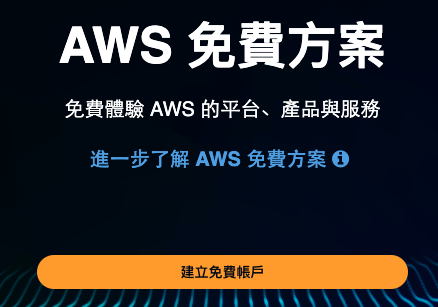
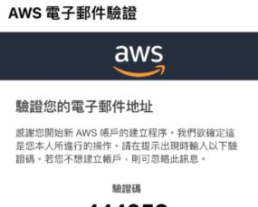
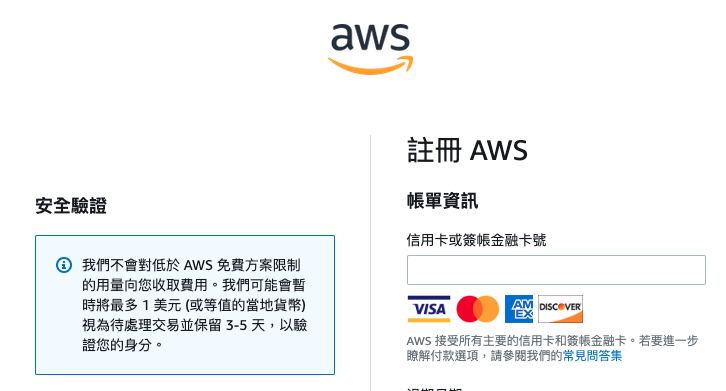
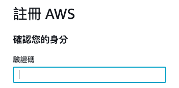
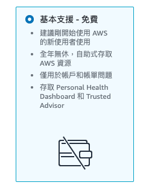
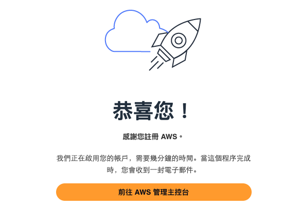
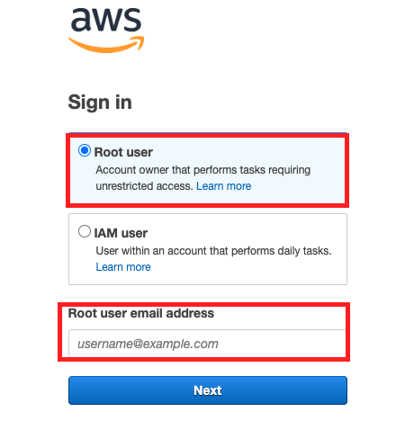
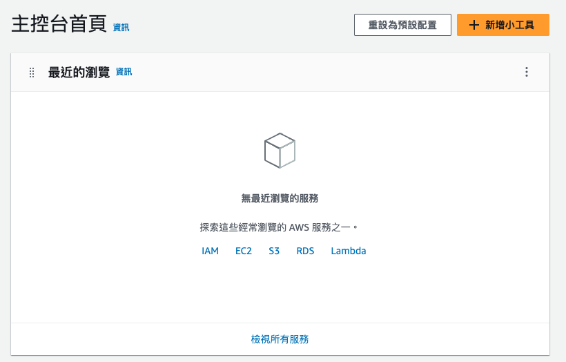

*實作*

# AWS

## 註冊免費帳號＆完成登入

1. 建立免費帳號

    

2. 填入 Email 及 自訂帳戶名稱

3. 驗證電子郵件

    

4. 會收到驗證碼

    

5. 過程中必須輸入信用卡

    

6. 手機驗證碼

    

7. 選擇免費

    

8. 完成

    

9. 登入試試看

    

10. 完成登入

    

 

---

*待續*

## 建立 IoT Core

## 設置樹莓派

## 串接樹莓派與 AWS

## 從樹莓派進行訂閱

## 範例實作
---

END

