*上課實作*

# GCP 
- Google Cloud Platform

[官網](https://cloud.google.com/?hl=zh_tw)


</br>

## 樹莓派建置工作環境

1. 安裝套件

```bash
pip install google-cloud-pubsub psutil
```

</br>

## 註冊並登入

[控制台](https://console.cloud.google.com/home/)

1. 搜尋

    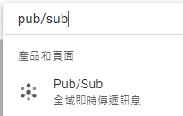

2. 建立主題

    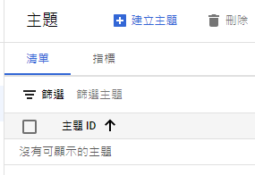

3. 命名並勾選項目

    

4. IAM 與管理

    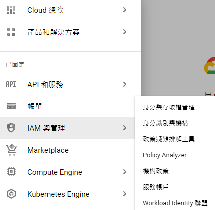

5. 建立服務帳號

    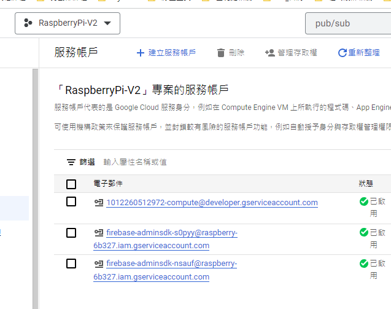

6. 填入資料
   
   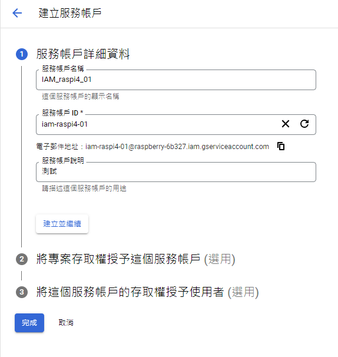

7. 詳細資料
   
   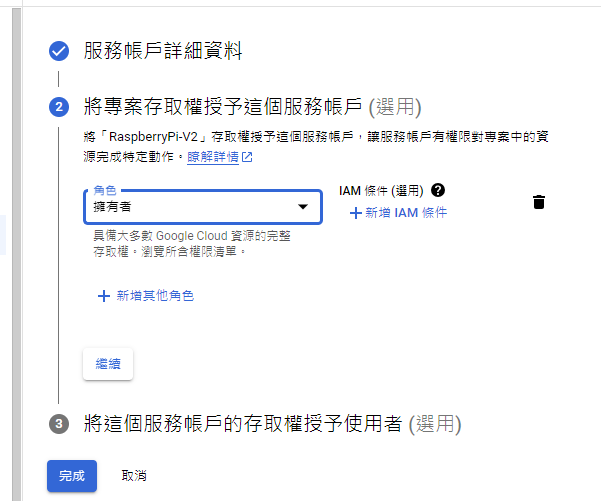

8. 金鑰

    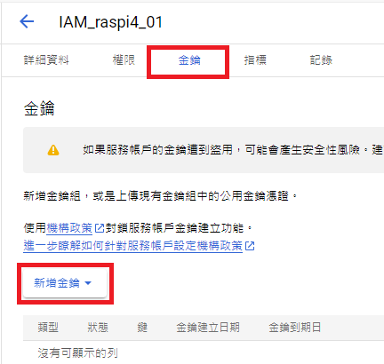

9. 建立新的

    

10. JSON
    
    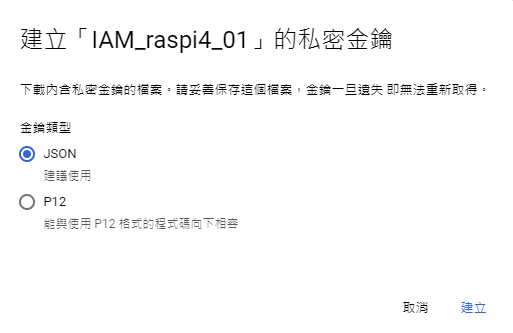

11. 自動下載到電腦上
    
    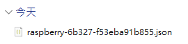

12. 建立訂閱
    
    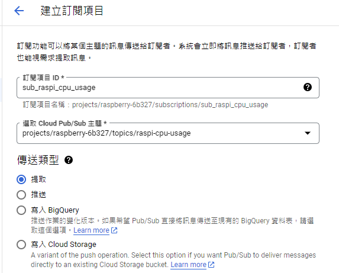

13. 建立

    

14. 重新選取
    
    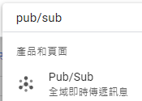

15. 選取設定好的服務
    
    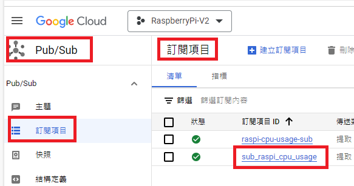

16. 查看一下
    
    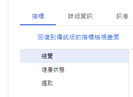

17. 在 VSCode 中運行

    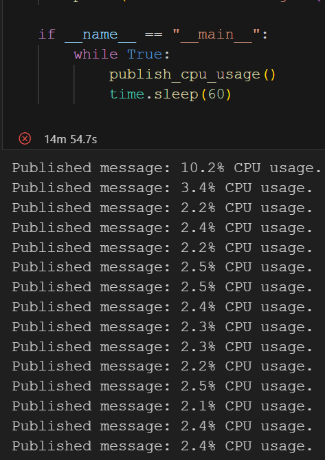


*以上完成運行測試*

---

*待續*
</br>

## 本地發佈

</br>

## 透過 GCP 查看訂閱

</br>

## 本地監聽訂閱

---

END