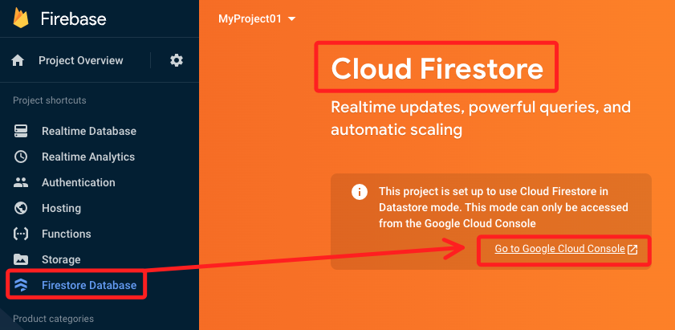
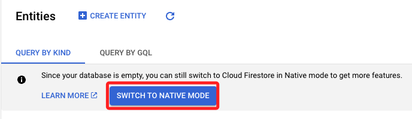
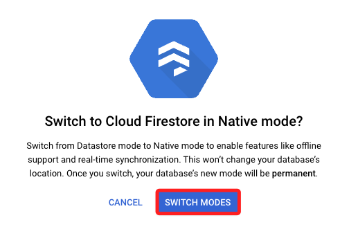

# Cloud Firestore

 

## 說明

_特別注意，一旦轉換到 Native 模式，就不能再回到 Datastore 模式_

 

## Native 模式

1. 即時更新：支持即時同步更新，方便如聊天應用或即時協作工具的實時應用。
2. 手機和網頁開發：提供豐富的客戶端庫以支持各種手機和網頁開發。
3. 靈活的查詢：支持複雜的查詢操作，比如排序和過濾。
4. 多區域數據儲存和同步：數據可以跨多個地區儲存並且在這些區域之間進行同步。
5. 支持手動分片：可手動控制數據的分片和索引，以優化性能。

 

## Datastore 模式

1. 伺服器端最佳化：主要為伺服器端應用程式設計，比如在 Google App Engine 中。
2. 自動分片和索引：分片和索引是自動管理的，這對於需要大規模數據儲存的應用來說非常有用。
3. 交易和強一致性：Datastore 提供強一致性的讀寫操作和支持交易。
4. 運行在 Google Cloud 內部的集成：Datastore 模式提供與其他 Google Cloud 服務更深層次的集成。
5. 不支持即時同步：與 Native 模式相比，Datastore 不支持即時數據同步。

 

## 轉換和兼容性

1. 如果一個項目從 Datastore 模式切換到了 Native 模式，它仍然可以通過 Google Cloud Datastore API 訪問數據。但是，一旦轉換到 Native 模式，就不能再回到 Datastore 模式。

2. 這兩個模式有不同的使用案例和優化點，但底層的數據結構是相同的。

3. 選擇哪一種模式取決於具體需求和應用案例，如果需要實時更新和豐富的客戶端庫支持，Native 模式會是更好的選擇，如果應用是服務器端重點，並且需要在 Google Cloud 平台內與其他服務有深層次的集成，那麼 Datastore 模式可能更適合。

 

## 切換方式

1. 進入 Firebase 專案

    

2. 進入 Cloud 轉換

    

3. 確認

    

 

---

_END_