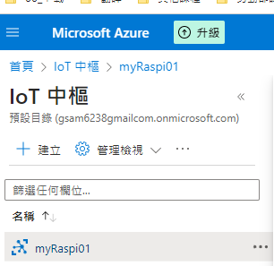
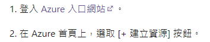
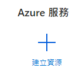
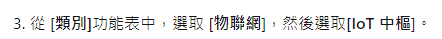
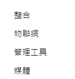
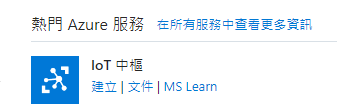

*上課講述*

# AZURE

[官網](https://azure.microsoft.com/zh-tw)

[官網說明](https://learn.microsoft.com/zh-tw/azure/iot-hub/iot-hub-raspberry-pi-kit-node-get-started」)

*關於註冊過程請親自操作完成*

## 準備工作

1. 安裝庫
```bash
pip install azure-iot-device
```

## 發佈到 Azure IoT Core

1. 在 IoT Hub 中建立一個新的裝置並取得裝置的連接字串
   
   

2. 登入
   
   

   [入口網站](https://portal.azure.com/?quickstart=true#home)

3. 建立資源

        

4. 選取
   
   

5. 左側選單
   
   

6. 選 IoT
   
   


---

*待續*

---
## 透過 Explore 觀察


## 透過 Stream Analytics


## 透過 IoT Central
