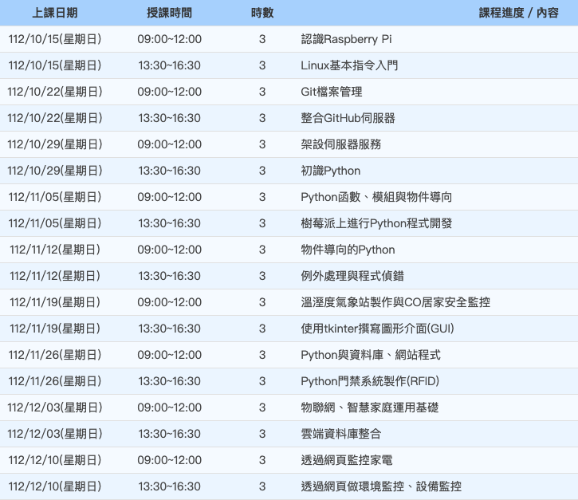

# 樹莓派課程 2023

[課程 Googoe Meet 連結](https://meet.google.com/dej-skyd-trv)

教室代碼 

```bash
dej-skyd-trv
```

[課程白板 Miro 連結](https://miro.com/app/board/uXjVPY6mQO4=/?share_link_id=905311425005)

[官方課綱連結](https://ojt.wda.gov.tw/ClassSearch/Detail?OCID=151975&plantype=1)



**小柱 Sam**

**Email 1：** gsam6238@gmail.com

**Email 2：** samhsiao6238@gmail.com

**Line ID：** sam6238

[**課程 GitHub**](https://github.com/samhsiao6238/RaspberryPi_20231015.git)

*在本次課程期間，非常歡迎同學將您期望了解的項目讓我知道，我會盡力融入在本課綱中，若時間不允許，或與課綱偏離，那我們再研究看看能否以其他方式進行介紹，總之～衷心希望給您一段開心的學習時光～*

*小柱*
*中柱*
